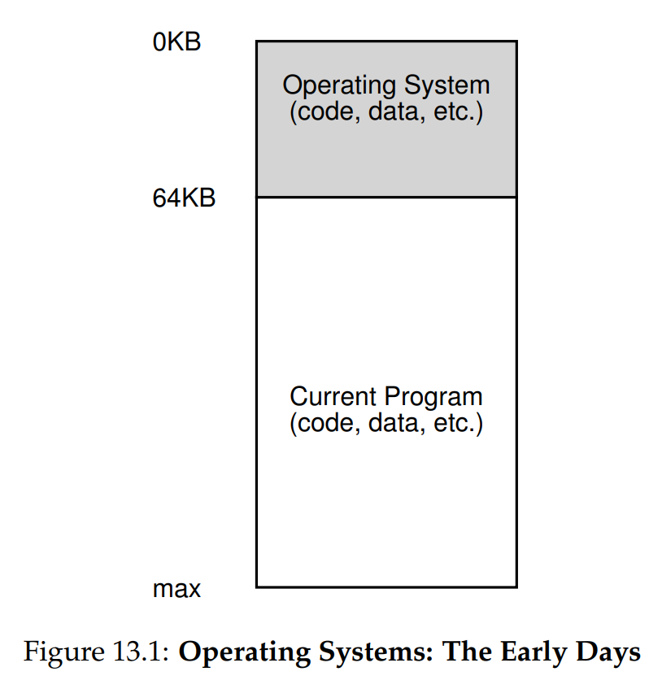
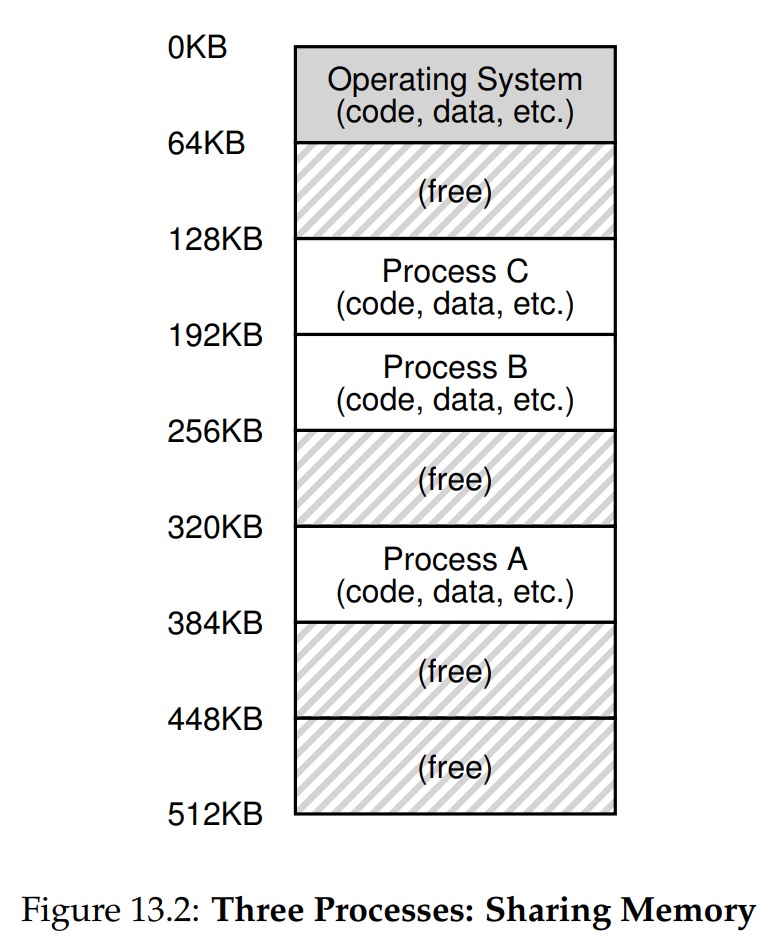
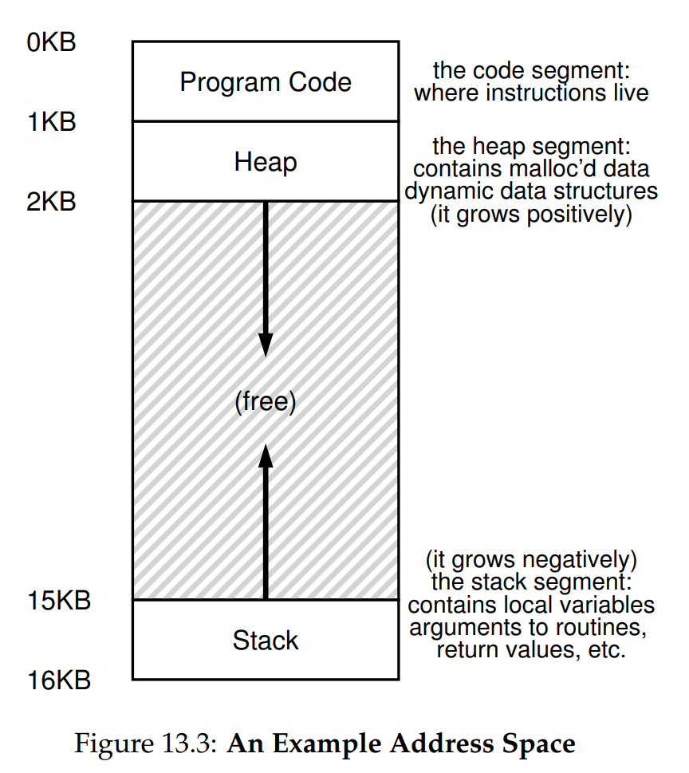

# Ch. 13 - The Abstraction: Address Spaces

### 13.1 - Early Systems

* In early systems, memory wasn't abstracted at all. The OS, a simple library, lived in some space of the physical memory, and the user code in the rest, as shown here:

### 13.2 - Multiprogramming and Time Sharing

* After a time, as computing complexity grew, multiple processes began to want to run at the same time, and the era of **multiprogramming** was born
* OSes began to take responsibility for scheduling processes, increasing efficiency in CPU utilization
* A simple way to do context switching w.r.t. the memory would be to give the running process access to the full memory. Then when stopping it, save its state (which is the entire memory) to the disk, load the other process's state from disk, and run
* Unfortunately this is very slow, especially as memory grows in size with time
* What we'd rather do is to leave processes in memory while switching between them, as shown here:

* This brings up the idea of **protection**, i.e. making sure each process can't read or write to another process's memory

### 13.3 - The Address Space

* An abstraction of the physical memory is the process's **address space**, which is the virtualized view the running process has of the memory
* The address space is visualized here:

* NOTE: The memory values used here are all for instructive purposes, can be wildly different across every OS implementation
* From 0 KB to 1 KB, we have the source code, where the instructions to be executed are stored
* Next we have two regions of the address space that may grow and shrink as the program runs:
  * The heap: Where dynamically-allocated, user-managed memory (such as memory allocated from `malloc()` in C or `new` in C++/Java) is stored
  * The stack: Used to keep track of where in the function call chain the process is, as well as to allocate local variables, passed parameters, and return values
* Of course this is all an **abstraction** to be clear., in a process called **virtualizing memory**. The actual physical memory, as we saw in Fig. 13.2, is wildly different for each process, they can't all go neatly from 0 KB to 16 KB
* So when the first instruction of Program A is `LD 0`, meaning load up my first instruction at memory address 0, the OS will actually load the correct address of the first instruction of Program A, which from Fig. 13.2 is at address 320 KB

### 13.4 - Goals

* What are our goals for virtualizing the memory?
* **Transparency**: We want the OS to virtualize memory in a way the process can't have access to. The running process shouldn't even be aware its memory is being virtualized
* **Efficiency**: Both in time and space the virtualization should be fast and compact, utilizing hardware support as much as possible
* **Protection**: The OS should protect processes from interacting with each other's address spaces
* Just as we did for CPU virtualization, we're going to study both the low-level **mechanisms** needed to virtualize memory, including hardware and OS support, as well as the high-level **policies** that will codify the philosophy of memory virtualization
