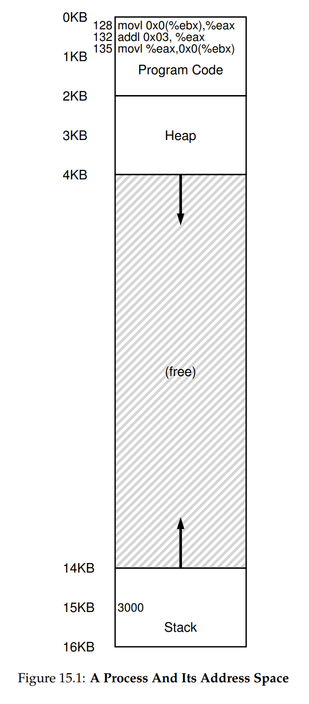
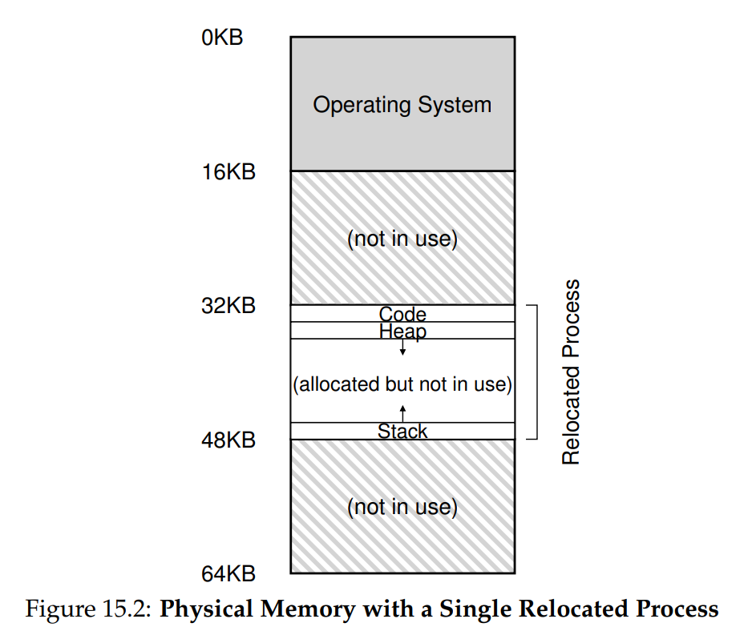
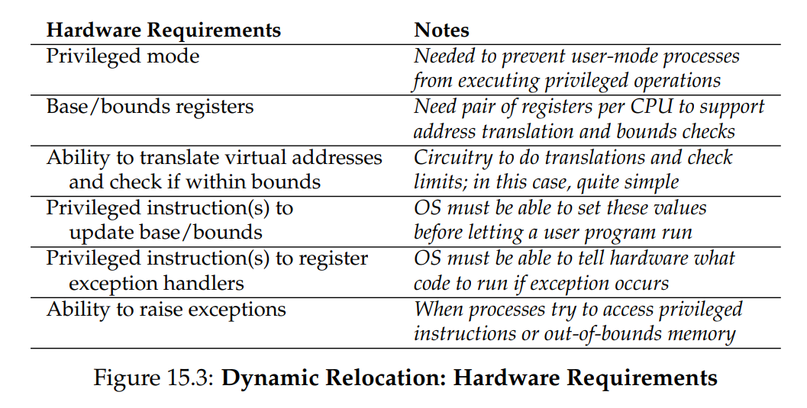
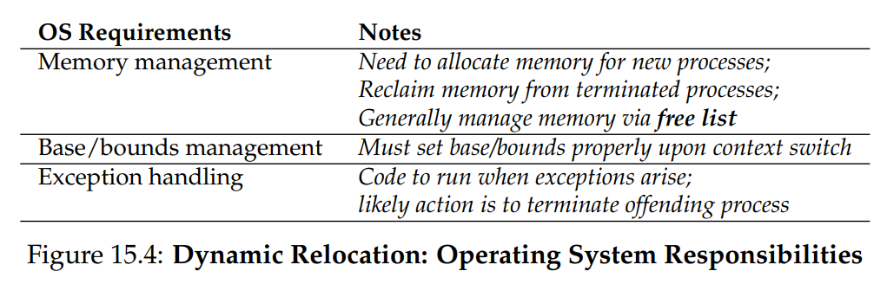
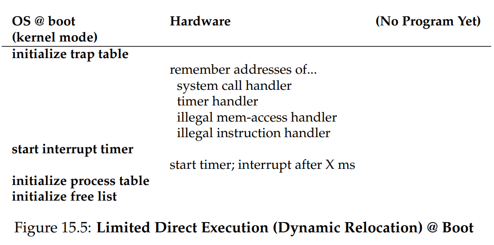
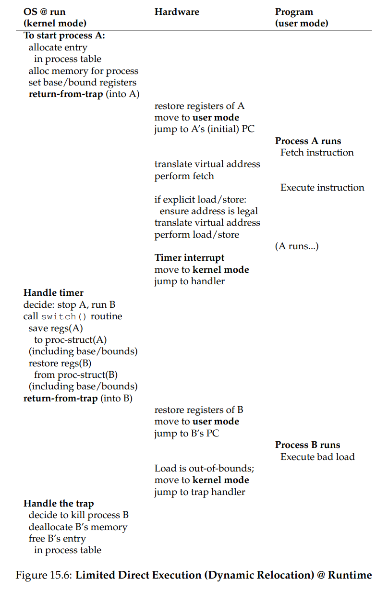

# Ch. 15 - Mechanism: Address Translation

* As a reminder, when virtualizing the CPU, we developed *limited direct execution*, or LDE
* The idea behind LDE is to let the program run directly on the CPU for the most part, however at certain key points (such as when the process does a system call, or a timer interrupt occurs), let the OS take back over and handle what happens next
* Thus the OS, with a little hardware support, tries to mostly just let the program run and provide an **efficient virtualization**, with some intermittent OS intervention to ensure the OS remains in charge of the overall workload
* In virtualizing memory, we'll do similarly, attaining efficiency while retaining control
* This efficiency will be achieved through much support from the hardware
> **The Crux: How to Efficiently and Flexibly Virtualize Memory?**
> How can we build an efficient virtualization of memory? How do we provide the flexibility needed by applications? How do we maintain control over which memory locations an application can access, and thus
ensure that application memory accesses are properly restricted? How do we do all of this efficiently?
* The generic technique: **Address Translation**, which changes virtual addresses to physical addresses

### 15.1 - Assumptions

* Our first attempts at virtualizing memory will, as with the CPU, start out very simple with lots of assumptions
* For now we'll assume:
  * User's address space must be placed contiguously in physical memory
  * Size of the address space is smaller than the size of physical memory
  * Each address space of each process is the same size

### 15.2 - An Example

* Say we have some code that initializes a local variable to some value, and later iterates it by 3:
```c
int x = 3000;
x = x + 3;
```
* In assembly, this looks like:
```
128: movl 0x0(%ebx), %eax    ; load 0+ebx into eax
132: addl $0x03, %eax        ; add 3 to eax
135: movl %eax, 0x0(%ebx)    ; store eax back to mem
```
* Here's a visual representation of how this looks in the process address space:



* So this will do the following memory accesses:
  * Fetch instruction at Address 128
  * Execute this instruction (load from address 0x00+15KB)
  * Fetch instruction at Address 132, and execute this instruction (no memory reference)
  * Fetch instruction at Address 135
  * Execute this instruction (store to address 0x00+15KB)
* However, let's recall the address space is always *virtualized*. In real physical memory, the OS might arrange the process in memory as:



### 15.3 - Dynamic (Hardware-based) Relocation

* One of the first implementations of hardware-based address translation was **base and bounds**, also called **dynamic relocation**
* This method uses two CPU registers, called the **base** and the **bounds**/**limit** register
* In this setup, when the program is compiled, the machine instructions base everything off the address space starting at an address of 0x0
* However when the process actually starts, the OS places the process somewhere in physical memory. Say it places it at 0x0+32KB
* Then, the base register value will be set to 32KB
* Now, say we have the instruction:
`128: movl 0x0(%ebx), %eax`
Here, the PC will be set to 128. When the chip fetches this instruction, it first adds the value to the base register value (32KB = 32768) to the PC, to obtain the physical address 32896
* When later down the line, we load the value at 15KB, the hardware will really look at 47KB
* So what does the bounds register do? It aids with protection. Specifically, the processor will first check to make sure the memory reference is within bounds
* If the process generates a virtual address that is greater than or equal to the bounds register value, the process will likely terminate

### 15.4 - Hardware Support: A Summary

* Let's review what support we need from the hardware:



* Two privilege modes, to aid in CPU virtualization, specifically with transparency
* Base/Bounds register, sometimes together part of the **memory management unit** (MMU) of the CPU
* Privileged options for updating the base/bounds registers, and to handle register exceptions

### 15.5 - OS Issues

* As there are a number of new hardware features we need to handle dynamic relocation, so to does the OS
* The OS needs to handle:



* The OS needs to find space in memory for a new process. Given our assumptions this is fairly trivial. The OS searches a data structure often called the **free list** to find room in memory for the new process
* When the process terminates, the OS must do some work to reclaim its memory
* Most importantly, the OS has to handle context switches, mainly saving/restoring the base/bounds registers (since there's only 1 of each). It stores these in a **process control block**
* Lastly, the OS should have some way to handle exceptions raised by the hardware
* Here is an example timeline at boot:



* And at runtime:



### 15.6 - Summary

* We have extended the concept of limited direct execution with a specific mechanism used in virtual memory, known as *address translation*
* The key to doing this efficiently is lots of hardware and OS support
* We examined a simple form of this translation using *base/bounds registers*, which is simple to implement and also offers protection
* Unfortunately this can be quite inefficient. For example in Fig. 15.2, we see that much of the address space is empty and taking up wasteful space on the memory. This type of waste is called **internal fragmentation**
* We will improve on the simplicity of base/bounds by implementing **segmentation**, discussed in the next chapter
