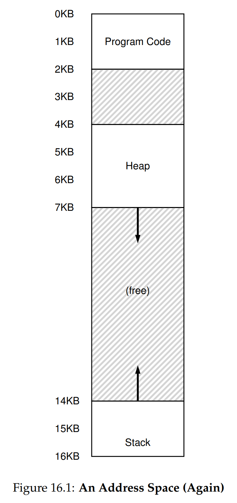
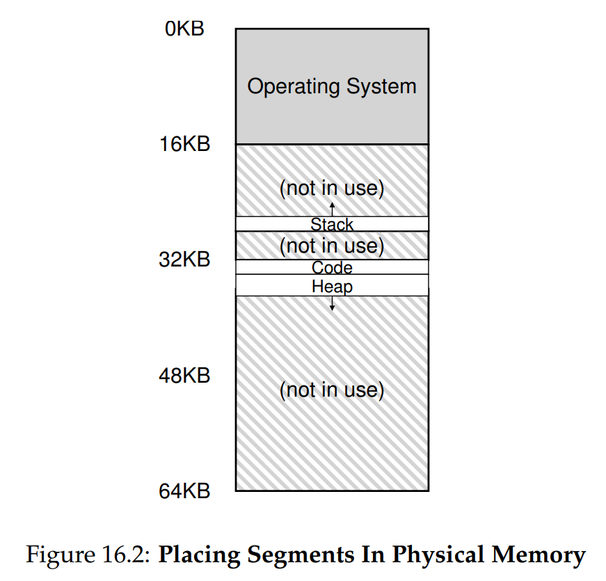
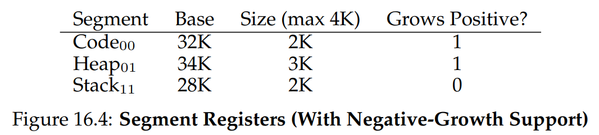
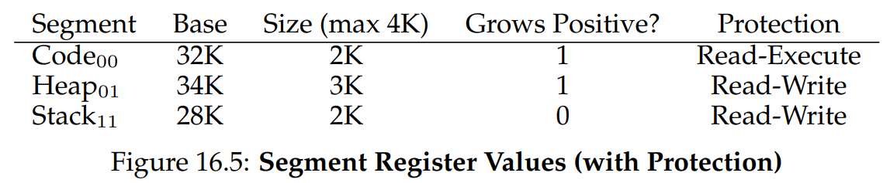
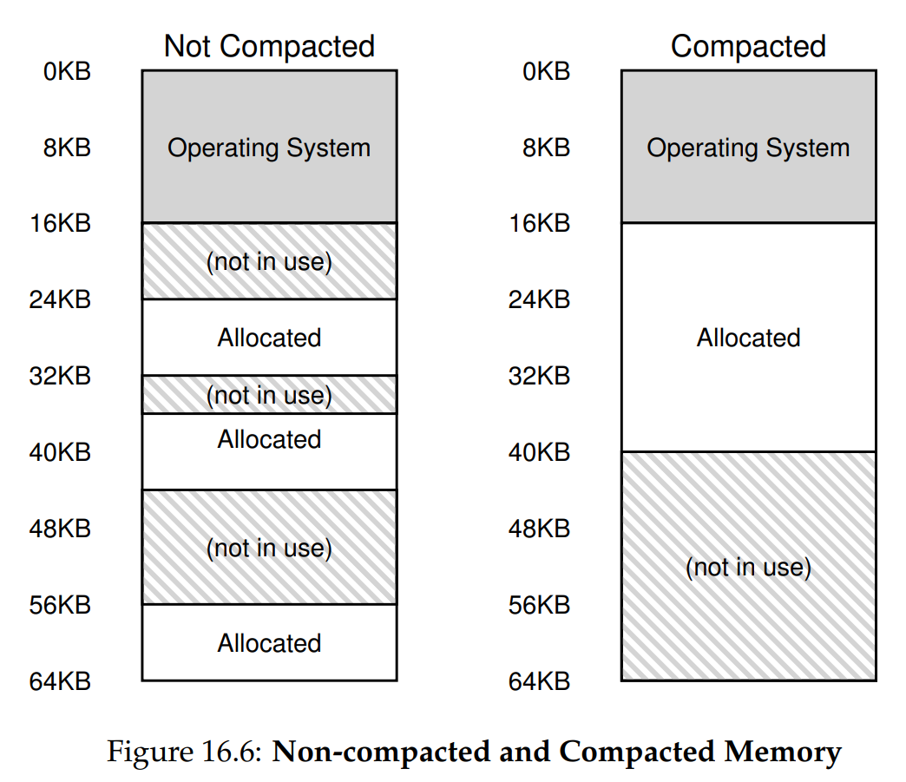

# Ch. 16 - Segmentation

* So far, we've been putting the entirety of each process's address space into memory
* This can be wasteful if the stack and heap are small
* This can also not be possible if the process's address space is too large for any of the free slots in memory
> **The Crux: How to Support a Large Address Space**
> How do we support a large address space with (potentially) a lot of free space between the stack and the heap? Note that in our examples, with tiny (pretend) address spaces, the waste doesn’t seem too bad. 
> 
> Imagine, however, a 32-bit address space (4 GB in size); a typical program will only use megabytes of memory, but still would demand that the entire address space be resident in memory.

### 16.1 - Segmentation: Generalized Base/Bounds

* The idea behind segmentation is simple and intuitive: instead of having just one base/bounds pair for the address space, why not have a pair for each "segment" of the address space?
* In our current address space setup, we have 3 segments: Code, Heap, and Stack. These can be visualized in the virtual address space as:

* If we now take a look at the physical memory:

* Now, the 9KB of the 16KB address space that were free don't have to be loaded into memory, which is more than a 200% gain in memory space efficiency!
* The hardware MMU has to updated of course to contain 3 base/bound register pairs
* Say we wanted to get address 4200 in the virtual address space, which lies in the Heap. To get the physical address, we want to first get the virtual address relative to the virtual heap base address, which is 4KB. So we get $\text{virtual offset} = 4200 - 4096 = 104$. So we add 104 to the heap base register, which in this case is 34KB, to get the final physical address: 34920
* If we try to access memory out of bounds, we get a **segmentation fault**, which might seem familiar!

### 16.2 - Which Segment are we Referring To?

* How does the hardware know which base and offset to use? One common approach is to use an **explicit approach**
* Our address space is 16KB, and so can be specified by a 14-bit virtual address
* We can use the top 2 bits (2 bits because we have 3 total segment) to specify the segment, and the rest of the 12 bits to specify the offset
* So for our example above, we'd set the virtual address to be $01\ 0000\ 0110\ 1000$, where $01$ specifies that 2nd segement, which is the heap, and the rest translate to 104 in decimal, which is the same offset we calculated above
* There are a couple problems with this approach:
  * Since our offset is a 12-bit number, the segments each have a maximum size of $\frac{1}{4}$ the address space, in this case 4KB
  * 1 of the segments is unspecified, which can lead to waste. Some OSes will combine code and heap into a segment and add another bit to the offset to account for this
* There are other **implicit** ways to do this as well

### 16.3 - What about the Stack?

* Remember, the stack grows backwards, towards zero. How can we account for this using the base/bounds segmentation method?
* We need to add a 1-bit register to the MMU that tracks whether the segment grows positively or towards zero:

### 16.4 - Support for Sharing

* System designers, as they were designing segmentation, realized another efficiency they could use: that sometimes certain memory segments, particularly code segments, can be shared between address spaces to save memory
* To support this, we need to add another register to the MMU:

* This tracks the permissions on each segment of the address space
* If a segment is read-only and is identical across multiple processes, these processes can all reference the same physical memory for that segment. This leads to an increase in efficiency

### 16.5 - Find-Grained and Coarse-Grained Segmentation

* Currently, we only have a few segments of our address space, call this **caorse-grained** segmentation
* You can also **fine-grain** the address space into many different segments
* These are no longer kept track of on the hardware, but instead in a table in memory
* The compiler would then be responsible for determining how to chop up the code and data into separate segments, which the OS and hardware would then handle

### 16.6 - OS Support

* Segmentation raises new issues for the OS:
  * How should the OS handle context switches? The answer is to have the OS save the segment regsiters, and restore when the process starts again
  * What should happen if the segments need to grow, e.g. if `malloc()` is called when the Heap is full? In this case, the code will perform a system call to grow the heap, which the OS will do if it can, and will reject if it can't
* Lastly, how do you manage free space on physical memory? Specifically, what if you have tons of segments from different processes in memory, and they all have little holes of free memory in between them, but each of these free holes is too small to fit a process segment? This is called **external fragmentation**, shown here:

* One solution is to periodically **compact the memory**, as shown above, into one contiguous block
* However this can be expensive on both the CPU and the memory, and makes requests to grow process segments difficult to handle
* Another option is to use a free-list management algorithm that tries to maintain large extends of free memory for allocation
* To note is that external fragmentation is impossible to eliminate, a good algorithm will only try to minimize it

### 16.7 - Summary

* Segmentation helps us solve a lot of problems, namely wasted free space sitting in memory, increased space and temporal efficiency, and code sharing
* However, it can also lead to issues, namely external fragmentation
* More importantly, segmentation still can't handle sparse segments of memory. What is the heap is large but mostly empty? This is still wasting precious memory space
* Let's figure out how to fix this in the next chapter!
* 
