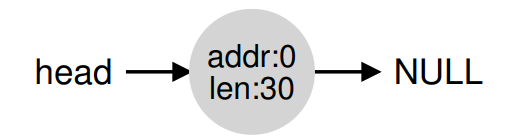
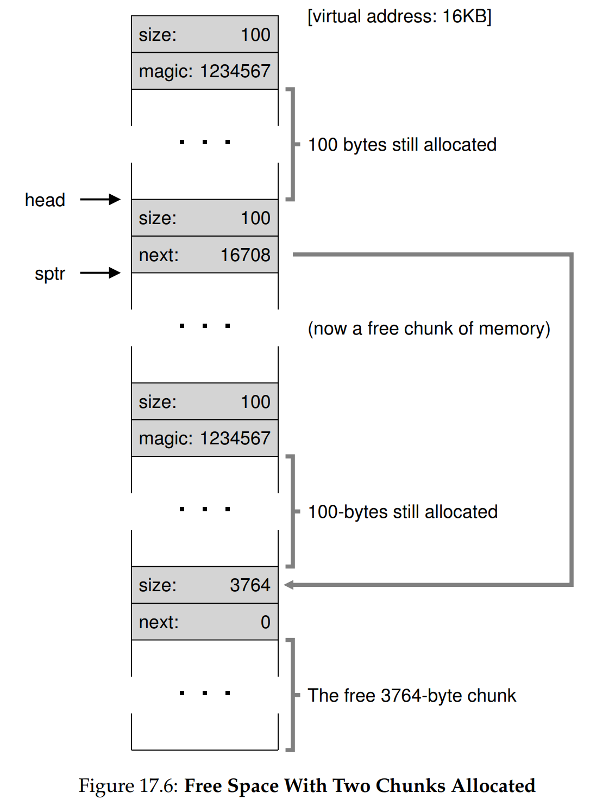

# Ch. 17 - Free-Space Management

* Let's discuss issues around free-space management
* In certain cases, this can be easy, such as when the memory being managed is divided into fixed-size units. This is related to **paging**, which will be discussed later
* However when memory is variably sized, free-space management becomes more complex and interesting. As we saw before, segmentation can lead to external fragmentation, where the free space becomes to fine-grained.
* Even if you have 100MB of free memory that you want to put a 20MB segment into, if it's all in 10MB chunks, you won't be able to
* This is an issue both for virtual memory management, using user-level memory-allocation libraries, and physical memory management, using OS-level system calls and hardware support
> **The Crux: How to Manage Free Space**
> How should free space be managed, when satisfying variable-sized requests? What strategies can be used to minimize fragmentation? What are the time and space overheads of alternate approaches?

### 17.1 - Assumptions

* Most of this discussion will focus on user-level memory-allocation libraries
* We assume a basic interface implemented with the two following C functions:
```c
void* malloc(size_t size)
void free(void* ptr)
```
* Note that `free()` doesn't need a size, the library will have to handle this somehow, as we'll see later
* This library manages the heap, the free space in the heap is a kind of free list (not necessarily a list, could be any data structure)
* We'll limit ourselves to the problem of external fragmentation (internal fragmentation if the user asks more space than they need for their heap and you get fragmentation inside the address space)
* We'll also assume that after memory is allocated, it can't be moved to somewhere else in memory, which makes compaction impossible (we'll assume that's the OS's job)

### 17.2 - Low-level Mechanisms

* We'll discuss some low-level mechanisms:
  * Splitting and Coalescing
  * How one can track the size of allocated regions quickly and with relative ease
  * How to build a list inside the free space to keep track of what is free and what isn't

##### Splitting and Coalescing

* Take the following 30-byte heap:


* The free list for this heap would have 2 elements like this:


* Clearly here if we tried to allocate 20 bytes of memory, this would fail
* What if we wanted to request something smaller, say just 1 byte of memory?
* Then the allocator will **split** the free memory, meaning it will find a free chunk of memory that can satisfy the request, and split it into 2 (not necessarily even) chunks. It will return chunk 1 to the user, and retain chunk 2 on the free list. So we'd get:


* Now the newly allocated memory lives on byte 20, and free space 2 goes from 21-29 instead of 20-29
* What if we had instead called `free()` on the one allocated chunk in the original example? We'd get something like this:


* But this is bad because the entire 30MB memory is free an unallocated, but we can't allocate even 15MB on it since the memory is still partitioned in 10MB chunks
* What allocators do to avoid this is coalesce all adjascent free space chunks whenever memory is freed. With coalescing, we get:



##### Tracking the Size of Allocated Regions

* We asked originally how `free()` keeps track of the size of allocated regions. Let's answer that now!
* To accomplish this task, most allocator store a bit of extra info in a **header** block which is kept in memory. Let's take a look at what this looks like:


* The magic number here is used for additional integrity checking and other information

##### Embedding a Free List

* Where does the free list actually live? It actually lives inside the free space itself
* To see this, let's take a 4KB heap, initialized by the following code:
```c
// mmap() returns a pointer to a chunk of free space, in this case 4KB of free memory for the entire heap
node_t* head = mmap(NULL, 4096, PROT_READ|PROT_WRITE, MAP_ANON|MAP_PRIVATE, -1, 0);
head->size = 4096 - sizeof(node_t);
head->next = NULL;
```
* So basically, both free and allocated chunks actually all have a header block which is kept in memory. We see this here:


* After initializing the heap, the free list has one entry, as seen above. To note is that the header structs of the free list members and the allocated chunks are different (as shown below, recall the allocated chunk headers have a magic number)
* Now when memory is request, say 100 bytes, the library will find a large enough chunk and then split it, as described above. Thus we get the following:


* If we assume each header is 8 bytes, then we allocate 108 bytes of memory, and return a pointer to the start of the allocated memory (without the header), indicated by the `ptr` in the figure above
* Including the free chunk header, we have taken 116 bytes of memory, and so we have $4096 - 116 = 3980$ bytes remaining free
* The head pointer points to the beginning of the header of the first free chunk
* Now let's allocate two more 100-byte chunks, and take a look at our heap:


* Now the first 324 bytes (3 * 108) of the heap are allocated
* What if we now call `free()` on the central allocated chunk, by doing `free(sptr)`? We'll get:



* Now since this is a free chunk, `head` points to the beginning of this chunk
* Let us now free the other allocated chunks. We now have a fragmented heap:


* Now we need to coalesce the heap into a 1 node free list
* Most allocators will initialize a small heap, and periodically grow it as necessary with some kind of system call (e.g. `sbrk` in Unix)

### 17.3 - Basic Strategies

* Let's go over some strategies for managing free space
* As usual due to the overwhelming variety of different situations that could arise with a user trying to allocate memory, there is no *best* approach, only situational approaches
* **Best Fit**: First, search through the free list and find chunks of free memory that are as big or bigger than the requested size. Then, allocate into the smallest candidate chunk. This helps avoid wasted space, however it may take a long time to find the correct free block
* **Worst Fit**: This is the opposite, find the largest chunk possible and allocate in there. However this has the same performance issue as above, also often leads to excessive fragmentation
* **First Fit**: This returns the very first block big enough. This has the avantage of being quite fast, but does pollute the free list with lots of tiny free chunks in the beginning of the free list
* **Next Fit**: This is the same as First Fit, but instead of starting over at the beginning of the list each time, it stores a pointer to the location within the list the last call was looking at

### 17.4 - Other Approaches

* Beyond the basic techniques described above, there are a number of other more complex approaches
> **NOTE**: I've omitted detailed descriptions of these for the sake of time, may update later

### 17.5 - Summary

* In this chapter, we've discussed the mechanism of rudimentary forms of memory allocators
* 
