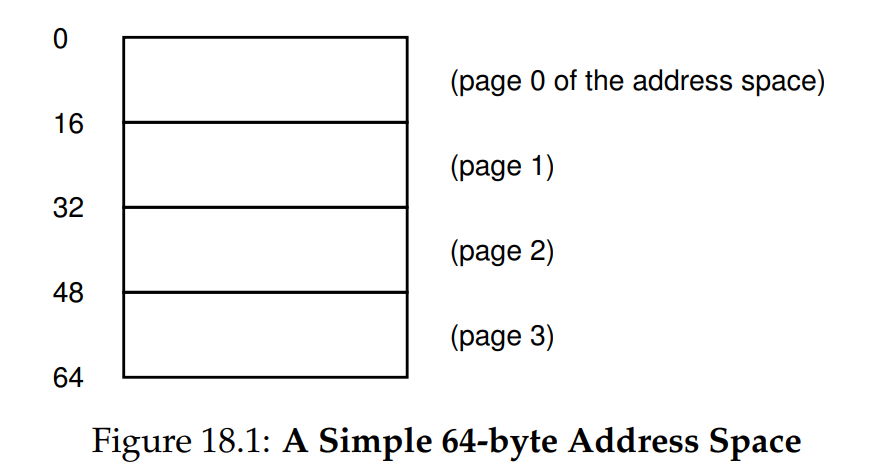
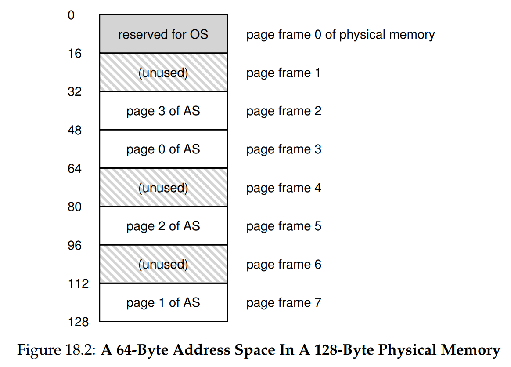
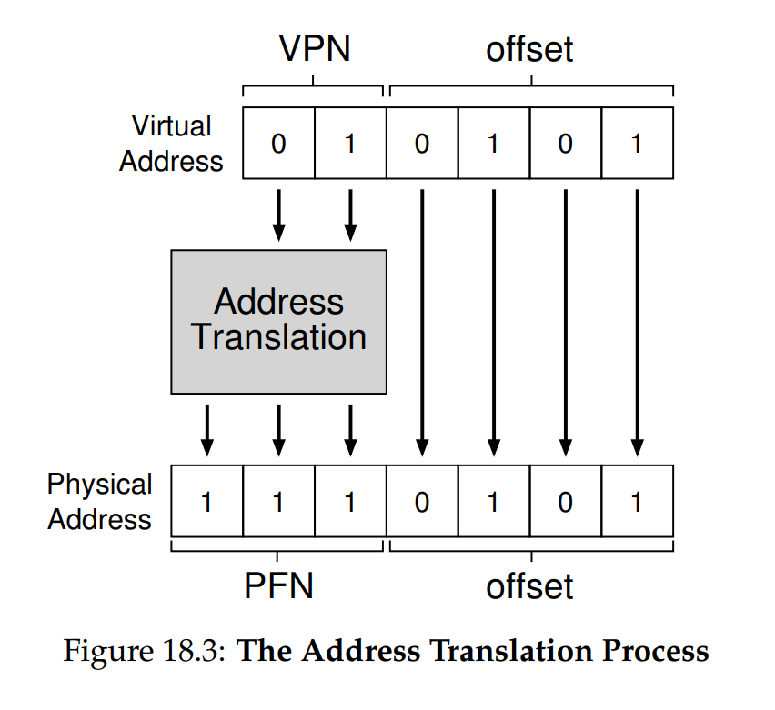
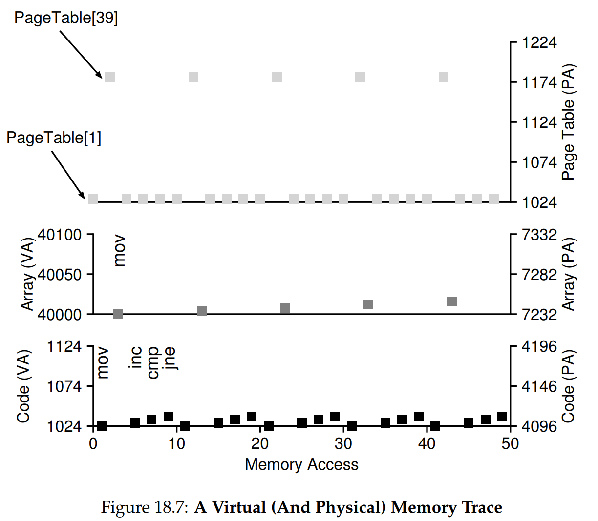

# Ch. 18 - Paging: Introduction

* There are two main approaches the OSs take to memory management:
  * **Segmentation**: Divide the memory into variable sized pieces, that can shrink or grow with system calls. Unfortunately, can lead to fragmentation
  * **Paging**: Divide the memory into fixed-size pieces, will avoid the issue of fragmentation
* Let's see how this works!
> **The Crux: How to Virtualize Memory with Pages**
> How can we virtualize memory with pages, so as to avoid the problems of segmentation? What are the basic techniques? How do we make those techniques work well, with minimal space and time overheads?

### 18.1 - A Simple Example and Overview

* Let's take a look at an example tiny address space that has paging enabled, with 16-byte pages:



* That's the address space, which is virtual memory. Now let's see what the physical memory looks like:



* As you can see, physical memory also consists of a number of fixed-size slots, in this case 8 **page frames**, which can each hold a page of virtual memory
* In the figure above, a number of the page frames have been filled with pages, 1 reserved by the OS, 4 by the address space, and 3 unused
* There are a lot of advantages here:
  * **Flexibility**: We can abstract the address space much more effectively. For example, now the direction of heap and stack growth are irrelevant
  * **Simplicity**: This is overall much simpler. For example, to find free memory, the OS can just find the first 4 free page frames, and give them to the allocator
* To record all this, the OS keeps a **page table** for each process. This has address translations for each virtual page of the address space to a physical address
* Say we have the following assembly instruction: `movl 21, %eax`, which says to load the value in address space location 21 into the register `%eax`
* Recall our 64-byte address space from above. Taking a look at that, we see that that address space location is in the middle of Page 1
* We can translate "21" into binary: $01 0101$. I split it up this way because assuming we always have a number of pages equal to $2^N$, we can always take the first $N$ digits of the binary as the Page #, and the rest of the binary digits as an offset into the page
* So, when the OS and hardware are given virtual address 21, that translates to: Look 5 bytes into Page 1. Page 1 is translated using the page table into a **physical frame number** (PFN). Looking at Fig. 18.2, we see that the PFN corresponding to Page 1 is PFN 7, as shown here:



* Now let's ask a few follow-up questions: Where is the page table stored? What are the typical contents of the page table, and how big are the tables? Does paging make the system too slow?

### 18.2 - Where are Page Tables Stored?

* Page tables can easily get very large!
* As an example, say we have a 32-bit address space with pages of size 4 KB, and $2^20$ pages in the address space. This would lead to a 20-bit VPN, and 12-bit offset
* Say we need 4 bytes to hold the vritual-to-physical memory translation data per page table entry
* Then, each process would have a 4 MB page table. For 100 processes, this is 400 MB in just page table data! Even in modern systems, which have GB of memory, this is a high cost

### 18.3 - What's Actually in the Page Table?

* The page table can be stored in many different types of data structures
* The simplest form is a **linear page table**, which is just an array
* The linear page table is indexed by the VPN, and the value at that index is the Page Table Entry (PTE). The PTE is used to get the physical address using the PFN
* Here's an example of the Page Table Entry for an x86 processor:


* Here we have the PFN, along with a number of 1-bit flags. Some of these are:
  * **Present Bit**: Indicates whether the page is in physical memory, or has been swapped out to disk
  * **Dirty Bit**: Indicates whether the page has been modified since allocation, or being brought from disk
  * **Reference Bit**: Useful for tracking whether a page has been accessed, and for how frequently the page is being used
  * **Valid Bit**: This is to mark whether the memory address is valid to access or not. For example, when a process begins running, it instantiates the code, heap, and stack. The rest of the address space is marked invalid, and if it's tried to be accessed, the hardware generates a trap to the OS
  * **Protection Bits**: These outline permissions for that page, such as whether it can be read or written
* Above we see the following bits:
  * P: Present Bit
  * R/W: Read/Write Protection Bit
  * PWT, PCD, PAT, and G: Determine how hardware caching works for these pages
  * A: Reference Bit
  * D: Dirty Bit

### 18.4 - Paging: Also Too Slow

* Page tables can take too much memory, and they can also be too slow
* Take our previous assembly instruction: `movl 21, %eax`, and assume again that we have the 4-page address space and 8-page frame physical memory as before
* Let's assume we have a single **page-table base register** which holds the physical address of the starting location of the page table
* To get to the PTE, we'd do:
```c
VPN = (VirtualAddress & VPN_MASK) >> SHIFT;
PTEAddr = PageTableBaseRegister + (VPN * sizeof(PTE));
PFN = ...;
offset = VirtualAddress & OFFSET_MASK;
PhysAddr = (PFN << SHIFT) | offset
```
* Here, `VPN_MASK` is $11 0000$ and `OFFSET_MASK` is $00 1111$, while `SHIFT` is $4$. So we get to the PTE's address by going off the base address, getting the PFN from the PTE, adjusting the PFN to get the physical address of the beginning of the page frame, and adding the offset by doing the bitwise OR
* As you can see, this is a lot of work for just 1 memory reference, and can become quite slow
* So there are two big problems we need to solve:
  * Pages lead to large page tables
  * They also lead to slow memory accesses
* Let's see how we can solve these

### 18.5 - A Memory Trace

* Let's trace what's happening with memory for a simple C program:

```c
int array[1000];
for (int i = 0; i < 1000; ++i) {
    array[i] = 0;
}
```

* So we are creating an array and setting its elements to zero
* Let's look at the assembly code this generates:

```
1024 movl $0x0,(%edi,%eax,4)
1028 incl %eax
1032 cmpl $0x03e8,%eax
1036 jne  1024
```

* Here are the elements in this code:
  * `%edi`: Contains the address to the base of the array, same as the variable `array`'s value
  * `%eax`: The register containing the value of `i`
  * `$0x03e8`: Hexadecimal literal, is $1000$ in decimal
  * `movl $0x0,(%edi,%eax,4)`: Store the literal 0x0 into the address equal to the sum of base of the array, the value in the register `%edi`, and 4 * the value of the `%eax` register (because `int`s are 4 bytes). This is basically saying `array[i] = 0`
  * `incl %eax`: Increment `i`
  * `cmpl $0x03e8,%eax / jne  1024`: If `i` is smaller than 1000, loop back to instruction at 1024
* Now say we have a 64KB virtual address space, with 64 pages each of size 1KB
* The code, as we see above, starts at virtual address 1024, which is the first address of VPN 01
* Say we also have a linear page table that is located at the physical address 1KB
* Let's also say that the array (which is 1000 * 4 bytes/integer = 4000 bytes in size) is located at virtual addresses 40000 through 43999, which constitutes VPN=39 through VPN=42 (since Page 39 starts at $39 * 1024 = 39936$ and Page 43 starts at $43 * 1024 = 44032$)
* Say we have the following virtual-to-physical mappings:
  * VPN 01 &#8594; PFN 04
  * VPN 39 &#8594; PFN 07
  * VPN 40 &#8594; PFN 08
  * VPN 41 &#8594; PFN 09
  * VPN 42 &#8594; PFN 10
* When each instruction above runs, it will generate at least two memory references: one to the page table in physical memory, to translate the instruction's virtual address to a physical one
* `mov` also does another memory reference, in order to access the array deep in physical memory through the page table
* Let's put this all together into this visualization:



* Recall that the Page Table is linear, and indexed by the Virtual address. Since the instructions live in Virtual Page 1, that is why we see lots of accesses to `PageTable[1]` in the top plot
* `mov` as we said is accessing the array at VPN 39, which is why we see accesses to `PageTable[39]`
* As you can see, for even simple code, tracing memory accesses can get very complex with pages!

### 18.6 - Summary

* We've introduced **paging** as a way to virtualize and manage memory that avoids external fragmentation and provides improved flexibility
* However it does have issues with space management and slowdowns
* We'll see in the next chapter how to address (pun intended!) these issues :D
