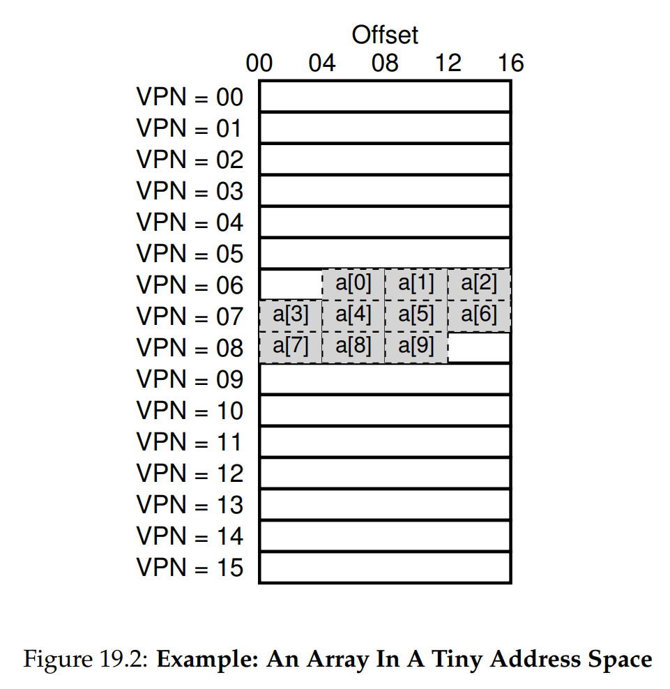

# Ch. 19 - Paging: Faster Translations (TLBs)

* Paging as the core mechanism of memory virtualization can help prevent segmentation, but produces large performance overloads
> **The Crux: How to Speed Up Address Translation**
* What has helped in the past to make algorithms more efficient? Why the OS, and its friend the hardware!
* We will do the same now and add machinery to the hardware's MMU in the form of the **translation-lookaside buffer**, or **TLB**, which will contain some populat virtual-to-physical address translations that are often used by the OS and processes
* For this reason, it's also known as an **address-translation cache**
* Whenever an address translation is requested, instead of looking to the page table, the hardware will first check the TLB
* Let's take a look at how this works

### 19.1 - TLB Basic Algorithm

* Let's take a look at some code that sketches out how the hardware might handle virtual address translation (NOTE: This isn't in C, it's pseudocode (I think so at least)):

```c
// Figure 19.1: TLB Control Flow Algorithm
VPN = (VirtualAddress & VPN_MASK) >> SHIFT // Gets the Virtual Page Number from the full Virtual Address
(Success, TlbEntry) = TLB_Lookup(VPN)
if (Success == True) {
    // The Virtual Page's translation is stored in the MMU's TLB
    if (CanAccess(TlbEntry.ProtectBits) == True) {
        Offset = VirtualAddress & OFFSET_MASK // Get the offset into the page
        PhysAddr = (TlbEntry.PFN << SHIFT) | Offset // Take the Page Frame Number and turn it into a physical address
        Register = AccessMemory(PhysAddr) // Load the value from the physical address into a register
    } else {
        RaiseException(PROTECTION_FAULT)
    }
} else {
    // The Virtual Page's translation isn't stored in the MMU's TLB, so we have to look for it in the Page Table
    // We start at the Page Table Base Register, and add an amount equal to the Virtual Page Number multiplied
    // by the size of the page table entries
    PTEAddr = PTBR + (VPN * sizeof(PTE)) 
    PTE = AccessMemory(PTEAddr) // Load the Page Table Entry from the address
    if (PTE.Valid == False) {
        RaiseException(SEGMENTATION_FAULT)
    } else if (CanAccess(PTE.ProtectBits) == False) {
        RaiseException(PROTECTION_FAULT)
    } else {
        TLB_Insert(VPN, PTE.PFN, PTE.ProtectBits)
        RetryInstruction()
    }
}
```

* The algorithm works as follows:
  * First, we extrac the VPN from the virtual address
  * We check if the VPN's translation is stored in the TLB
  * If it is, we get a **TLB hit**! We then extract the PFN from the relevant TLB entry, form the physical address, and acces memory, assuming the memory is readable (check protection bits)
  * If the CPU doesn't find the translation in the TLB, we get a **TLB miss**
  * In this case, we actually don't fetch from memory yet! We first add the address translation we're trying to do into the TLB (as long as the PTE and the protection bits are valid)
  * We then actually redo the instruction, and this time the translation for our instruction is found in the TLB, and run through the first control path
* This helps optimize our paging a lot, *as long as* TLB misses are uncommong, since with each miss we actually have more overhead than normal paging for inserting the PTE into the TLB

### 19.2 - Example: Accessing an Array

* Let's examine a virtual address trace, and how TLB's improve performance
* Say we have an 8-bit address space, which means we have 8-bit addresses, so 256 locations, each with a byte of memory
* Let's break out address space into 16 pages, each with 16 bytes, so we have a 4-bit VPN and 4-bit offset
* Take an array of 10 4-byte integers and place the first entry at the virtual address $0110 0100$, so VPN=6 and offset=4. This is displayed visually as:



* Now let's write some C code to calculate the sum of the array elements:

```c
int sum = 0;
for (int i = 0; i < 10; i++) {
    sum += a[i];
}
```

* As we can see, here the array covers 3 Virtual Pages. So when accessing the array elements, we'll get 3 TLB misses, and after those are written to the TLB, we'll get TLB hits for the other 7
* So the TLB hit rate is 70% for this, which is surprising since this is the first time the array has ever been accessed
* NOTE: The page size plays a role here, a bigger page size would've resulted in an even higher TLB hit rate

> **Tip: Use Caching When Possible**
> Caching is one of the most fundamental performance techniques on modern computer techniques, one that is used again and again to make the "common-case" fast
> The idea is simple, to utilize both **temporal locality** and **spatial locality**. The idea is that instructions just accessed are likely to be followed by a similar instruction soon after, and that instruction is likely consecutive in memory, such as with an array
> We use small caches because of physical constraints, as the smaller the cache the faster it can be. A large cache with defeat its entire purpose

### 19.3 - Who Handles the TLB Miss?

* On old systems, the hardware used to handle the TLB management
* On modern architectures, the hardware instead simply raises an exception (last line in Fig. 19.3 below), which pauses the current instruction stream, raises the privilege level to kernel mode, and jumps to a trap handler
* This trap is code within the OS that handles TLB misses. Schematically this looks like:

```c
// Figure 19.3: TLB Control Flow Algorithm (OS Handled)
VPN = (VirtualAddress & VPN_MASK) >> SHIFT
(Success, TlbEntry) = TLB_Lookup(VPN)
if (Success == True) { // TLB Hit
    if (CanAccess(TlbEntry.ProtectBits) == True) {
        Offset = VirtualAddress & OFFSET_MASK
        PhysAddr = (TlbEntry.PFN << SHIFT) | Offset
        Register = AccessMemory(PhysAddr)
    }
} else {
    RaiseException(PROTECTION_FAULT)
} else { // TLB Miss
    RaiseException(TLB_MISS)
}
```

* One important note here is that the Return-from-Trap (RTI) instruction has to be modified, as in this case we don't want to return to the PC but instead to PC-1, since we want to rerun the instruction that caused this TRAP
* Second, when running the TLB miss handling code, the OS needs to be careful to not cause an infinite chain of TLB misses to occur

### 19.4 - TLB Contents: What's in There?

* The TLB can have anywhere from 32 to 128 entries, and is **fully associative**, meaning any translation can be anywhere in the TLB, and that the TLB will be searched in parallel to find the desired translation
* A TLB has: The VPN, the associated PFN, and other bits:
  * **Valid Bit**: Is the entry a valid translation or not
  * **Protection Bits**: How can the page be accessed (same as the page table)
  * Other similar to the PTE bits, such as address-space identifier, and dirty bit

### 19.5 - TLB Issue: Context Switches

* Question: What happens if we context switch to another process, which has its own address translations? The TLB contains translations that are only valid for the currently running process
* To visualize this concern, say we have two processes; Proc 1 has its VPN=10 mapped to PFN=100, while Proc 2 has its VPN=10 mapped to PFN=170. Then:


* Here, VPN=10 is overloaded. How does the hardware know which entry is for which process?
> **The Crux: How to Manage TLB Contents on a Context Switch?**
> When context-switching between processes, the translations in the TLB for the last process are not meaningful to the about-to-be-run process. What should the hardware or OS do in order to solve this problem?

* There are a number of solutions to this. One simple way is to flush the TLB on every context switch. However, this reduces the effectiveness of the TLB
* Some architectures reduce this overhead by instead adding hardware support in the form of an **address space identifiers (ASID)** column in the TLB:


* As you can see, now there is no confusion about which translation belongs to which process
* NOTE: Why use ASID instead of PID? The ASID can often be much shorter, e.g. 8 bits instead of 32 bits for a PID

### 19.6 - TLB Issue: Replacement Policy

* As with any cache, the TLB needs a policy to decide, when installing a new entry in the TLB, which old entry to replace
> **The Crux: How to Design the TLB Replacement Policy?**
> Which TLB entry should be replaced when we add a new TLB entry? The goal, of course, being to minimize the miss rate (or increase hit rate) and thus improve performance.
* We'll cover this more when we tackle the issue of swapping pages to disk

### 19.7 - A Real TLB Entry

* Let's take a look at a real TLB! This example is from the MIPS R4000, a modern system that uses OS-managed TLBs (NOTE: this has been slightly simplified):


* The MIPS R4000 supports a 32-bit address space with pages that are 4KB ($2^{12}$) in size. So we have a 20-bit VPN, and a 12-bit offset
* However in the figure above, we actually see a 19-bit VPN. This is because half of the space is reserved for the kernel
* The VPN translates to a 24-bit PFN, so we can tell that we have 64GB of memory (we have $2^{24}$ page frames each of size 4KB, so we have $2^{36}$ bytes, or 64GB, of memory)
* We also see a **global bit** (G), which if set says that the page is globally-shared among processes. Thus if the global bit is set, the ASID is ignored
* Speaking of which, we see the ASID stored as well, as an 8-bit code
* We also see a 3-bit **coherence** code, which determines how the page is cached by hardware
* We also see **dirty** bits and **valid** bits, which we've described before
* Finally, we have a **page mask** field, which is not shown here, which supports multiple page sizes
* Most TLBs have 32 or 64 of these entries, where a few of them are reserved for OS usage
* A **wired register** can be used to by the OS to tell the hardware which entries to reserve for itself
* The MIPS R4000 instruction set has a number of instructions that can be used by kernel mode processes to update the TLB

### 19.8 - Summary

* We've seen how the TLB can make paging much more efficient, in the common case making making the virtualization performance overhead almost vanish
* However, there are still some issues. For one, if a process accesses a number of pages larger than the entry limit of the TLB, you will generate a large number of TLB misses, which will slow things down significantly. This is called the **TLB coverage** problem
* One solution, which we'll discuss in the next chapter, is to include support for larger page sizes, which will increase the effective amount of memory the TLB covers
* TLB access can also become a bottleneck in the CPU pipeline, in particular with that is called a **physically-indexed cache**. With such a cache, address translation has to take place *before* the cache is accessed, which can slow things quite a bit
