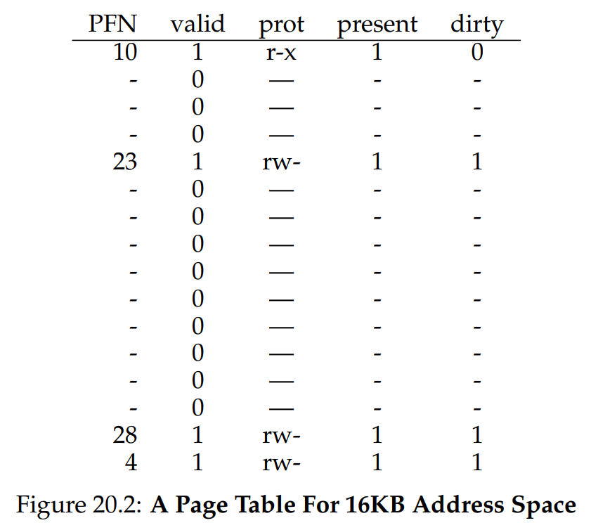
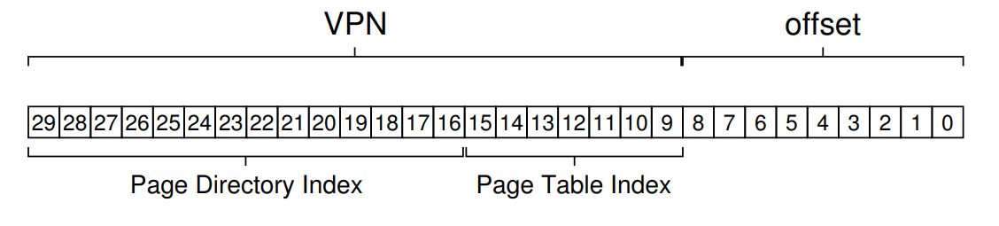

# Ch. 20 - Paging: Smaller Tables

* Page tables constume too much memory. Recall a previous calculation that said that for a 32-bit address space with 4KB-size pages and each PTE being 4-bytes in size, each process would have a page table of 4MB
* Thus for 100 processes, our page table would take up almost half a gigabyte of memory by itself!
* We need to find a way to lower this spatial burden!
> **The Crux: How to Make Page Tables Smaller?**
> Simple array-based page tables (usually called linear page tables) are too big, taking up far too much memory on typical systems. How can we make page tables smaller? What are the key ideas? What inefficiencies arise as a result of these new data structures?

### 20.1 - Simple Solution: Bigger Pages

* One simple solution is, just make the pages bigger! That way we have fewer total pages, and fewer total PTEs
* For example, if we used 16KB-sized pages in the above example, we would only use 1 MB per process for the page table, or 100 MB in total for 100 processes, which is a lot more doable
* However, recall why we used pages in the first place. It was to prevent fragmentation. With large pages, we run the risk of **internal fragmentation**, where inside the page, the memory is wasted due to inefficient memory allocation

### 20.2 - Hybrid Approach: Paging and Segments

* Whenever you have two reasonable approaches to a problem, both with pros and cons, often the best solution is a mixture of these approaches
* To see how this works, let's take an address space of 16KB with 1KB pages:


* This has the following page table:



* As you can see, most of the page table is full of invalid entries, which wastes a lot of space!
* We can relieve this by segmenting the Code, Heap, and Stack blocks, using the base-bound registers of the MMU as we did before
* But now, instead of the base register pointing to the start of the segment in physical memory, it instead points to the physical address *of the page table* of that segment, where now each segment has its own page table
* And the bounds register, instead of holding the size of the segment in bytes, instead holds the number of pages that are valid in that segment's Page Table
* However, this runs into the same issues that segmentation had, namely fragmentation, and in this case can even run into page table waste

### 20.3 - Multi-Level Page Tables

* One of the best solutions to this problem, now used in most modern systems such as x86, is a **multi-level page table**
* Let's take a look at how this works:


* On the left is our original version of the Linear Page Table
* Here, when a VPN is given, its corresponding PFN is found. To refresh memory, here's how it's calculated (in pseudocode):
```c
PTEAddr = PTBR + (VPN * sizeof(PTE)) 
PTE = AccessMemory(PTEAddr) // Load the Page Table Entry from the address
```
* Recall that the Linear Page Table is indexed by VPN
* So here, say if we had VPN=14, we'd translate that to the PTE located at PFN=204 + offset=2, which would give us that VPN=14 corresponds to PFN=86
* On the right, we see a Multi-level Page Table, which has at the top the **page directory**, which is a page table for PTEs, if that makes sense
* Each entry of the page directory is a **page directory entry**, or PDE
* So in our previous example, taking `sizeof(PDE) = 4 * sizeof(PTE)`, we can translate VPN=14 into PDE=3, which itself leads to PFN=204 + offset=2, and the PFN=86 that we found above
* This has some great advantages:
  * You only need page table space for the pages that contain a valid PTE entry
  * We add a level of indirection, which makes accessing the relevent PTE a lot simpler
* We do have some disadvantages of course:
  * On a TLB miss, we now have to do 2 memory accesses instead of just one
  * We have also introduced a lot of complexity
* However, since TLB hits are much more common than TLB misses, these trade-offs are worth it

##### A Detailed Multi-Level Example

* Let's take the following:
  * Address space size: 16KB
  * Page size: 64 bytes
  * Addressability: 14-bits, with 8-bit VPN and 6-bit offset
  * Size of Page Table: 256 PTEs
* We can take a look at the address space here:


* Let's assume each PTE has a size of 4 bytes, meaning if we used a Linear Page Table, it would have a size of 256 $\times$ 4 bytes $=$ 1KB
* This means that the Linear Page Table can be stored in a Page Directory with 16 Page Directory Entries, each linking to a Page Frame that has 16 PTEs (since 16 * 16 = 256, which is the number of PTEs in the Page Table)
* Let's take a look at an example Virtual Address:


* Here as before with the Linear Page Table we have the 8-bit VPN, but now we've also noted the first 4 bits as the **page-directory index**, or PDIndex for short
* We also then note the rest of the VPN as the **page-table index**, or PTIndex for short, which can be used to offset into the Page Directory Entry itself:


* So in total, to get to a Page Table Entry starting from the Virtual Address, we do:
```c
VPN = (VirtualAddress & VPN_MASK) >> VPN_SHIFT
PDIndex = (VirtualAddress & PDIndex_MASK) >> PDIndex_SHIFT

PDEAddr = PageDirBase + (PDIndex * sizeof(PDE))
PDE = AccessMemory(PDEAddr)
PTEAddr = (PDE.PFN << SHIFT) + (PTIndex * sizeof(PTE))
```
* Here, `SHIFT` is equal to the size of the Page Frames (same as size of Pages), in order to accommodate the offset into the Page Frame
* Let's now take a look at an actual Page Directory:


* As you can see, the code and heap pages, that were located near the start of the address space, are in the first Page Directory Entry, located at PFN=100. And the stack pages, located at the very end of the address space, are in the final Page Directory Entry, at the bottom of that entry's page
* Hopefully now it's easy to see why this is useful: Instead of allocating *16* pages for this small process, we only allocated *3*: The Page Directory, and its two Entries
* Let's do a quick translation to test this out. Let's look at: $1111 1110 000000$, which poins to the 0th byte of VPN=254
* The last 4 bits represent `PDIndex=15`, and `PTIndex=14`
* Taking a look at Fig. 20.5, `PDIndex=15` points to `PFN=101`. The 14th index of that Page Directory Entry corresponds to `PFN=55`. So we get the virtual-to-physical translation `VPN=254` to `PFN=55`. This combined with our offset of `000 000` tells us to look at physical address:
```c
// PTE.PFN = 55 = 0011 0111
PhysAddr = (PTE.PFN << SHIFT) + offset
//       = 0011 0111 000 000 + 0000 0000 000 000
//       = 0011 0111 000 000
//       = 0x0DC0
```

##### More than Two Levels

* Sometimes, we need a deeper tree!
* Say we have a 30-bit virtual address space with a small 512 byte page, which results in a 21-bit VPN and 9-bit offset
* With a 2-level Page Directory, and a PTE size of 4 bytes, we'd get a 7-bit PTIndex, and therefore a 14-bit PDIndex, as we see here:



* Therefore the top-level Page Directory spans not 1 page, but 128!
* To remedy this, we add another layer:


* We add a PDIndex1, which is also 7-bit, and therefore now the top level Page Directory, indexed by PDIndex0, is now 6-bit addressable, and can fit inside 1 page
* We can see an example of a code that handles this here:

```c
VPN = (VirtualAddress & VPN_MASK) >> SHIFT
(Success, TlbEntry) = TLB_Lookup(VPN)

if (Success == True) {
    if(CanAccess(TlbEntry.ProtectBits) == True) {
        Offset = VirtualAddress & OFFSET_MASK
        PhysAddr = (TlbEntry.PFN << SHIFT) | Offset
        Register = AccessMemory(PhysAddr)
    } else {
        RaiseException(PROTECTION_FAULT)
    }
} else {
    PDIndex = (VPN & PD_MASK) >> PD_SHIFT
    PDEAddr = PDBR + (PDIndex * sizeof(PDE))
    PDE = AccessMemory(PDEAddr)

    if (PDE.Valid == False) {
        RaiseException(SEGMENTATION_FAULT)
    } else {
        // PDE is Valid! Now fetch the PTE from the PDE
        PTIndex = (VPN & PT_MASK) >> PT_SHIFT
        PTEAddr = (PDE.PFN << SHIFT) + (PTIndex * sizeof(PTE))
        PTE = AccessMemory(PTEAddr)

        if (PTE.Valid == False) {
            RaiseException(SEGMENTATION_FAULT)
        } else if (CanAccess(PTE.ProtectionBits) == False) {
            RaiseException(PROTECTION_FAULT)
        } else {
            TLB_INSERT(VPN, PTE.PFN, PTE.ProtectBits)
            RetryInstruction();
        }
    }
}
```

* We can see how this is similar to the code we saw for the Linear Page Table, except now its doing 2 memory accesses instead. This is the increased cost we get on TLB misses, but in return we get far more efficient memory usage by the page table

### 20.4 - Inverted Page Tables

* An even more extreme space saving solution is the **inverted page table**
* Here, instead of having many page tables, one for each process, we keep a single giant page table that has an entry for each physical page of the system
* The PTE tells us which process is using this page, and the translation between the VPN and PFN
* A Hash Table is often implemented to lookup the relevent PTE in this giant Page Table
* In general, recall that Page Tables are just data structures, and as such their implementation is highly flexible. What we've seen, with multi-level and inverted page tables, are just two examples

### 20.5 - Swapping the Page Tables to Disk

* As a bit of a preview, in the next chapters we're finally going to relax our last assumption: that the page tables reside in kernel-owned physical memory at all times
* This assumption is violated when some systems in certain conditions, such as if the page table is still taking up too much memory even after our optimizations, **swap** these page tables into the disk
* We'll see this in more detail soon!

### 20.6 - Summary

* We've seen how page tables can be built on more complex data structures, with trade-offs in time but advantages in spatial efficiency
* Which page table data structure is right will depend on the architecture. Really, it's up to the OS developer: You!
