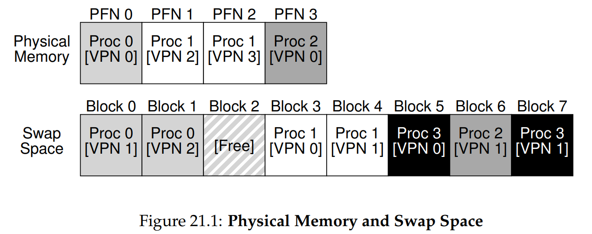

# Ch. 21 - Beyond Physical Memory: Mechanisms

* We're going to relax one of our assumptions: That every address space is small, and all process address spaces can fit in physical memory
* Now, we'll wish to support many concurrently-running large address spaces
* To do this, we're going to store rarely-used pages in the **hard disk drive**, usually called disk, that sits in the lowerst rung of the memory hierarchy
> **The Crux: How to Go Beyond Physical Memory?**
> How can the OS make use of a larger, slower device to transparently provide the illusion of a large virtual address space?
* Question: Why support large address spaces, even for smaller processes? The idea is that this way the user doesn't have to worry about allocation; just allocate as much as you want and need, and you won't have to worry about segmentation faults

### 21.1 - Swap Space

* First, we need to reserve some space on the disk called **swap space**, which we'll use for moving pages back and forth
* To do so, the OS will need to remember the **disk address** of every page-sized chunk of memory written to disk
* As a simple example, let's imagine we have 4 processes with 3, 4, 2, and 2 pages in their address space respectively. However, the physical memory is only 4 pages long. We can set up a swap space of 8 pages in the disk to handle this:

* As you can see, Procs 0-2 have their active pages on memory and their inactive pages in the swap space. Proc 3 is actually not even currently running, potentially being in a blocked state, and has all its pages in the swap space
* NOTE: Swap space is not the only on-disk location for swapping needs. Consider you're doing `cat` on a file. The `cat` executable is on disk, and is pulled into memory to be run. But if a context switch occurs and memory space is low, the OS instead of moving the executable to swap space can simply flush it from memory, and reload it from the file system when the context switches back

### 21.2 - The Present Bit

* How does swapping interact with the TLB? We need to add a **present bit**, which will tell the OS if the physical memory being referred to is in physical memory, or if the bit is cleared that it's in the swap space
* The act of accessing a page that is not in physical memory is commonly referred to as a **page fault**
* In the next section, we'll describe how the OS handles page faults

### 21.3 - The Page Fault

* In responding to a page fault, the OS must retrieve the missing page from disk and insert it back into memory. But how does the OS find this page on disk?
* One place to store this information is in the Page Table Entry, so the OS can look in the relevant PTE to find the disk address
* Now when the I/O is complete and the page is back in memory, the OS will tell the hardware to retry the instruction. This will generate a TLB miss, causing the OS to add the translation to the TLB, and will tell the hardware to try the instruction a second and last time. This will generate a TLB hit!
* Note that while the page-fault generated I/O is processing, the process will be in a *blocked* state, letting other processes run

### 21.4 - What if Memory is Full?

* Can we always fetch the page from disk? What if the memory is full or close to full?
* In this case, the OS may want to first swap out one of the pages on memory into the disk
* How does the OS pick which page? The OS needs a good **page-replacement policy**
* This needs to be highly robust, as picking the wrong page to swap out can cause a program to run at disk-like speeds instead of memory-like speeds, perhaps even up to a 100,000 times slower!!!
* We will study such a policy in the next chapter

### 21.5 - Page Fault Control Flow

* Thus we now know what happens when a program fetches some data from memory (going to assume no protection errors):
  * Look for the virtual-to-physical memory translation in the TLB
  * If we get a TLB Hit, great! We access the physical memory and exit this control flow
  * If we get a TLB miss, we try to find the translation in the Page Table
  * If we don't find it there, we rase a `SEGMENTATION_FAULT`
  * If we find it there and it's present, great! We add the translation to the TLB and retry the instruction
  * If we find it there and it's on the disk, we raise a Page Fault
* The way the OS handles Page Faults is:
  * We look for a free PFN in the physical memory. If it's not there, we use some policy to swap out one of our page frames into the disk
  * We use the PTE's disk address to find the page on disk, and load it into the free PFN
  * We then retry the instruction

### 21.6 - When Replacements Really Occur

* In reality, the OS doesn't wait until the memory is full to swap out memory, and in fact keeps some of the memory free more proactively
* To help do this, most OSs have a **high watermark (HW)** and **low watermark (LW)** to help decide when to start evicting pages from memory:
> If fewer then LW pages available, swap pages to disk until you have HW pages free
* There is a background thread that does this, sometimes called the **swap daemon** or **page daemon**
* Many OSs will **cluster**/**group** a number of pages and write them to disk at once, to increase efficiency of the disk (reduces seek and rotational overhead, will learn more about this later)

### 21.7 - Summary

* We introduced the notion of accessing more memory than is physically present within a system
* To do so, we introduced the **present bit** into the PTE
* If a non-present page is attempted to be accessed a **page fault** is generated, which is handled by the OS, which places that page from disk back onto memory, swapping out existing pages on memory to disk as needed
* Recall that these actions all take place **transparent** to the process, who thinks it has a continuous large address space in memory
