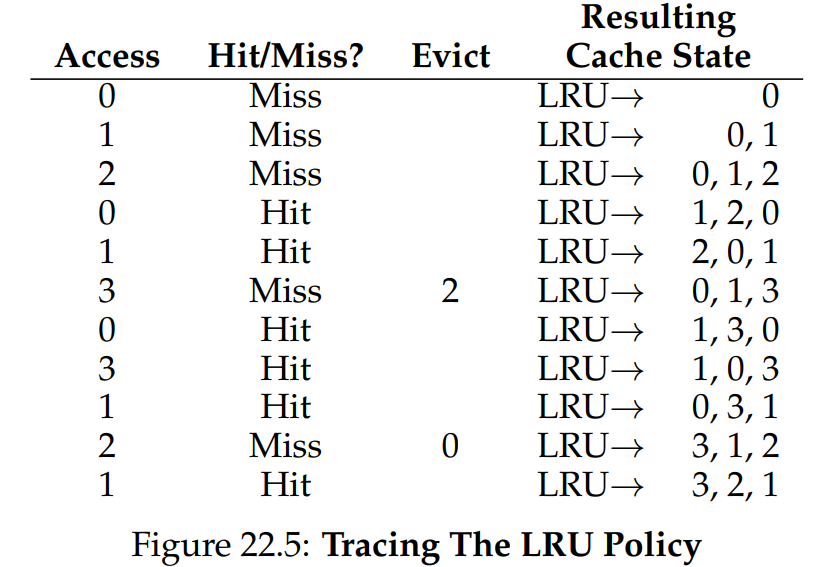
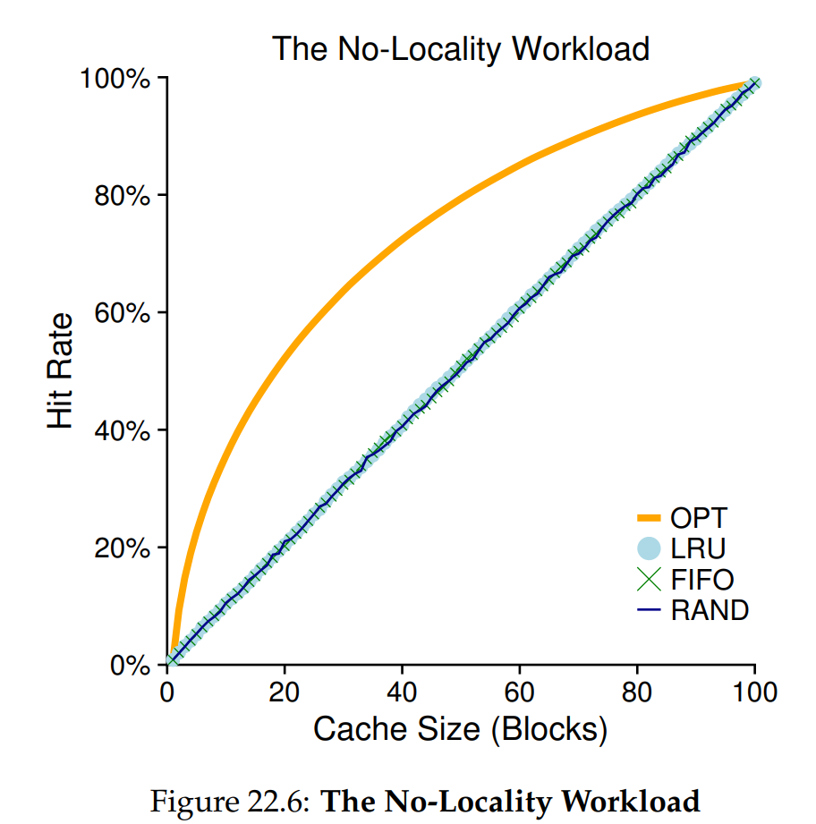
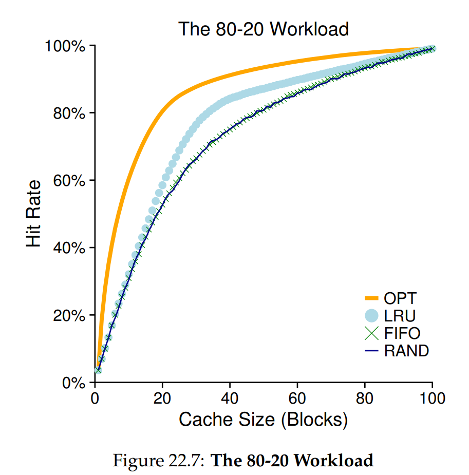

# Ch. 22 - Beyond Physical Memory: Policies

* If we have a lot of free memory, page management of virtual memory is fairly easy: If a page fault occurs, you find a free page on the free-page list, and assign it to the faulting page that's been swapped to disk. In this case, we don't need a policy to manage memory
* However, in most cases memory will be heavily utilized and most of it will not be free, which creates **memory pressure** which forces the OS to actively page out pages to disk. Deciding which pages to evict is encapsulated in the **replacement policy** of the OS, and is one of the most important policies historically of the OS in general
> **The Crux: How to Decide which Page to Evict?**
> How can the OS decide which page (or pages) to evict from memory?
This decision is made by the replacement policy of the system, which usually follows some general principles (discussed below) but also includes certain tweaks to avoid corner-case behavior

### 22.12 Summary

* We have introduced a number of page-replacement (and other) policies, which are part of the Virtual Memory (VM) subsystem of all modern OSes
* We examined the Lease-Recently Used (LRU) page replacement policy, which we saw needs approximation to be implemented effectively
* For many years, the discrepancy between memory and disk read/write times made page-replacement policies irrelevant, the idea being that the discrepancy was so large that the policy made little effect. To fix slow paging systems, you just needed more memory
* However now with SSDs, which have much faster I/O, page-replacement policies have become much more important

### 22.1 - Cache Management

* The essence of our problem is that we want to minimize page faults (if we think of our memory as a cache for the total virtual memory, since usually virtual memory `>` physical memory, we can also call this a **cache miss**)
* We can quantify this using:
$$\text{AMAT} = T_M + (P_\text{miss} \cdot T_D)$$
where AMAT is the **average memory access time**, $T_M$ and $T_D$ are the cost of accessing memory and accessing disk respectively, and $P_\text{miss}$ is the propability of a cache miss
* Say we have a tiny address space of 4KB with 256-byte pages, which gives us 16 virtual pages. We have a process that uses 10 virtual pages. Let's now assume that each of those virtual pages exacept Page 03 is in memory
* So, we have a miss rate of 10%. If $T_M = 100 \text{ ns} = 0.0001 \text{ ms}$  and $T_D = 10 \text{ ms}$, then we have that $\text{AMAT} = 0.0001 \text{ ms} + (0.1 * 10 \text{ ms}) = 1.0001 \text{ ms}$
* As you can see, the AMAT is absolutely dominated by the amount of time the OS needs to do IO. Clearly minimizing disk I/O and cache misses is extremely important for OS performance

### 22.2 - The Optimal Replacement Policy

* The optimal page replacement policy, disregarding implementation difficulty, is the one which replaces pages that will be accessed *furthest in the future*
* This has an intuition to it, since only paging out to disk the page that will be used furthest in the future will allow ones that will be used sooner to remain in memory
* However obviously this will require knowledge of exactly what page references are coming up in the future, which is difficult to impossible to implement, at least efficiently

### 22.3 - A Simple Policy: FIFO

* A very simple policy is FIFO
* However, FIFO performs quite poorly in the general case, generating a bad hit rate of about 30% for a test case compared to almost 60% for the optimal policy above

### 22.4 - Another Simple Policy: Random

* We can also simply pick which page to evict to disk randomly
* Overall random does slightly better than FIFO and slightly worse than Optimal

### 22.5 - Using History: LRU

* FIFO and Random have the same problem: they are likely to evict an important page, one that might soon be referenced again. We need something smarter, that can remember the page use history and make decisions based off of that
* One type of historical info that is valuable for page-replacement is **frequency**/**recency** of access. The family of policies that utilize this information are called the **principle of locality**
* This gives us two policies: **LFU** (Least Frequently Used) and **LRU** (Least Recently Used)
* We can see here how LRU works for a sample workload:

### 22.6 - Workload Examples

* We can also examing the average hit rate for the policies we've covered above for a range of workloads varying with cache size
* For a Non-local workload, which means pages are randomly accessed all over memory with no locality, we get a hit rate vs. cache size that looks like:

where OPT is the optimal policy, and the rest are as described above

* As we can see, for a completely random workload, LRU does no better than the others (aside from OPT). This makes sense since a random workload has no meaningful history
* We next consider an "80-20" workload, where 80% of the references are to 20% of the pages, and the other 20% references are to the other 80% of pages. This is still random, but results in significant locality
* Now, we get a hit rate vs. cache size that looks like:

* Now we see that LRU does provide an improvement! But is this improvement significant? It really depends on whether the cost of each page miss is significant or not

### 22.7 - Implementing Historical Algorithms

* How do we actually implement this algorithm? Essentially, on every page access, we need to update some data structure to move this page to the front of the list of recently accessed pages
* One way to do this could be to have a time variable for each page that we store in the hardware. Whenever the page is accessed, its time value is set to right now
* Clearly we can immediately see that this will be very costly if implemented exactly. If we have 1 million pages for example, then we will need to scan a list of a million numbers in the hardware for each page access
> **The Crux: How to Implement an LRU Replacement Policy?**
> Given that it will be expensive to implement perfect LRU, can we approximate it in some way, and still obtain the desired behavior?

### 22.8 - Approximating LRU

* The solution to this is that we approximate LRU instead of implementing it exactly
* We implement a **use bit** in the hardware for each page. Whenever a page is accessed, its use bit is set
* One way to approximate LRU is the **clock algorithm**. In this case, a "clock hand", which is essentially a pointer, starts pointing to some page $P$ on page access. If that page's use bit is 0, it will be paged to disk and swapped out for the page we're trying to get into memory
* Otherwise, the clock hand will set the use bit of the page it's pointing to to 0, and will iterate to $P+1$, and beyond, until it finds a page with its use bit set to 0 already
* This does a fairly good job at approximating LRU in a way that is much faster

### 22.9 - Considering Dirty Pages

* One modification we can make here is to add another flag, a **dirty bit**, to the CPU's MMU
* The idea here is that if a page is in memory and it hasn't been changed since it was read from disk, we in fact don't have to waste time paging it to disk, we can simply rewrite it, since that page is already on disk
* This can be kept track of using the dirty bit, which is set everytime the page is modified
* The clock algorithm can then scan for pages that are unused and clean. If it doesn't find any, it can then do the old method of unused pages

### 22.10 - Other VM Policies

* There are other policies we need for a good VM management system. We also need to decide for example when to bring a page into memory
* For most pages, the OS uses **demand paging**, which means the page is brought into memory when it is accessed
* We also need a policy of how to write pages to disk. Often, instead of writing one at a time, pages are written to disk in **clusters** of writes. This is more efficient due to the nature of disk drives (which we'll learn about later)

### 22.11 - Thrashing

* What should the OS do if memory is oversubscribed, and the memory demands of the workload simply exceed the available physical memory?
* In this case, the system will constantly be paging between memory and disk. This is called **thrashing**
* Some older OSes would try to run a priority subset of processes, to try to get them to fit in memory and finish running
* Some modern OSes will simply run an **out-of-memory killer** when memory is oversubscribed. This daemon chooses a memory-intensive process and simply kills it, which effectively reduces the strain on memory
