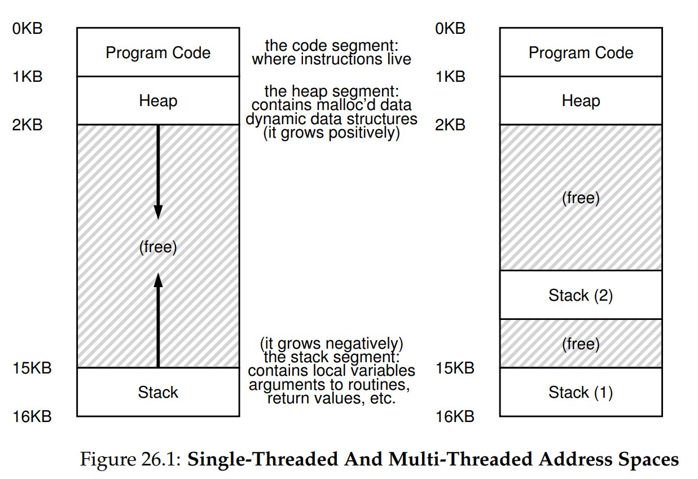
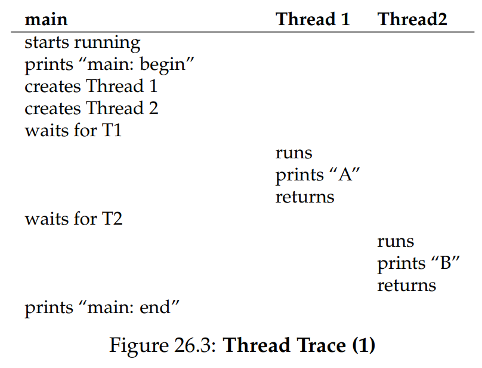
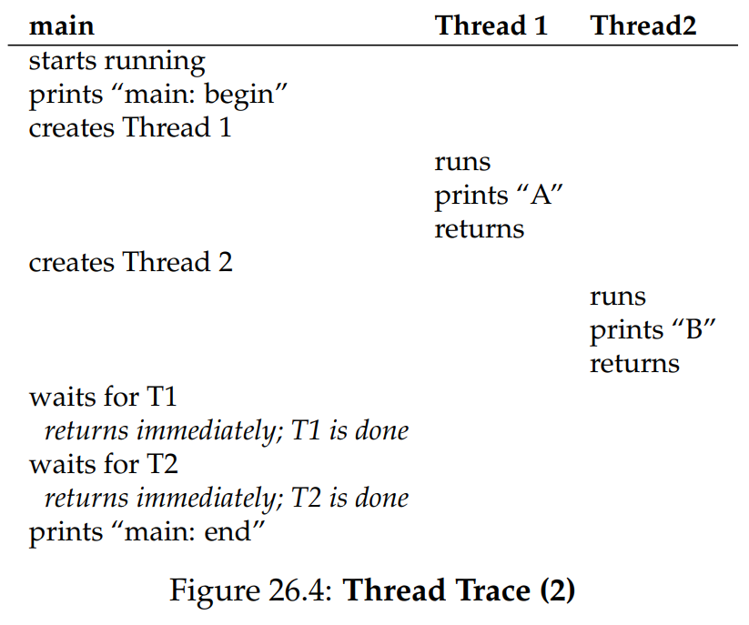

# Ch. 26 - Concurrency - An Introduction

* So far, we've covered both CPU and memory virtualization
* In this section, we'll talk about a new abstraction for a single running process, which is a **thread**. We are going to be working now instead of single points of executionsi in a program, now with multi-threaded programs
* Threads are basically the same as processes, except that they share the same address space, and thus can access the same data
* Each thread has its own PC, and set of virtual registers. Same as processes, threads can only run one at a time, and must be switched between using context switches
* In a context switch for a thread, instead of the state (PC + registers + other data) being saved to Process Control Blocks (PCBs), they are now saved to **Thread Control Blocks (TCBs)**. And of course as mentioned, unlike processes, a context switch for threads leaves the address space unchanged
* The shared memory also looks different for threads, since it needs to have multiple stacks for each thread, which looks like this:



* This causes some issues for the clean approach we took to the address space before, where the stack and heap could grow until they met. Now each stack has less room to grow and can run into other stacks. Fortunately stacks are almost always small, so usually it doesn't create an issue

### 26.1 - Why Use Threads?

* Threads give us a powerful tool: **parallelism**, where multiple actions can happen at the same time. You may be wondering, how does this help if only one thread can run at a time on the CPU? This is true, that parallelism can't occur on a single-cored CPU
* However, these days most CPUs have multiple cores, and so you can run multiple processes at the same time. So threads can take advantage of that and have the same process run on multiple cores in a way at the same time, speeding up execution
* This can also help your process still do useful things while I/O is occuring (e.g. thread 2 does CPU work while thread 1 is idle for I/O)

### 26.2 - An Example: Thread Creation

* Let's look at a code that creates two threads, one which prints "A" and the other prints "B":

```c
void *mythread(void *arg) {
    printf("%s\n", (char *) arg);
    return NULL;
}

int main() {
    pthread_t p1, p2;
    int rc;

    // Creates 2 threads, that will run the *mythread* function, with arguments "A" and "B"
    Pthread_create(&p1, NULL, mythread, "A");
    Pthread_create(&p1, NULL, mythread, "B");

    // Pthread_join waits for the thread given to finish
    Pthread_join(p1, NULL);
    Pthread_join(p2, NULL);

    return 0
}
```

* So in total we have 3 threads here, the main process, and the 2 child threads. Let's think about how these could be ordered in execution:



* This is one option, where the main process creates Thread 1, creates Thread 2, and then waits as they execute. But we could have also had this execution order instead:



* Here, the scheduler context switches to Thread 1 after it's been created but before Thread 2 can be created
* There are still more options, for example in the first example, the scheduler could've run Thread 2 before Thread 1, so we could've seen "B" printed first
* Threads clearly make life more complicated, and this will only get worse! ;)

### 26.3 - Why it Gets Worse: Shared Data

* We get further complexity with threads using shared memory:

```c
// The global variable each thread's function will update
static volatile int counter = 0;

// A simple looping function that counts up to 10,000,000, using a single shared global variable
void *mythread(void *arg) {
    for (int i = 0; i < 1e7; ++i) {
        counter += 1;
    }
    return NULL;
}

// As before, creates two threads, and runs the *mythread* function on each thread
int main() {
    pthread_t p1, p2;
    Pthread_create(&p1, NULL, mythread, "A");
    Pthread_create(&p1, NULL, mythread, "B");

    Pthread_join(p1, NULL);
    Pthread_join(p2, NULL);
    return 0;
}
```

* So, since each thread iterates the counter 1e7 times, we would expect the final value of `counter` to be 2e7. However, sometimes we will get a strange result, such as `19,345,221`. This may even change with each run!
> **Tip: Know and Use Your Tools**
> A *disassembler* is a very useful tool that can be used to show the assembly instructions in an executable. On Linux, this can be done using the `objdump -d exec` command

### 26.4 - The Heart of the Problem: Uncontrolled Scheduling

* Let's take a look at an example of the assembly that is generated by the `mythread` function:
```c
mov 0x8049a1c, %eax
add $0x1, %eax
move %eax, 0x8049a1c
```
* Here, the variable `counter` is stored in memory at the address `0x8049a1c`, and in the first instruction is moved into the register `%eax`. The literal 1, represented by `$0x1`, is added to the registers value. Finally, the register value is stored back into the address `0x8049a1c`
*  The way this can go wrong is this:
   * Say the counter is at 50 when Thread 1 runs an iteration of its loop
   * It loads 50 into `%eax` in the first instruction, and adds 1 to it in the second instruction
   * Now let's say before the second instruction can run, there's a context switch to Thread 2, perhaps because of a timer interrupt for example
   * So the value in memory at `0x8049a1c` is still 50 ! Because Thread 1 hadn't had a chance to store the register value back into memory
   * Thread 2 executes, and changes the value at `0x8049a1c` to 51
   * When Thread 1 resumes, it finishes its last instruction and also stores 51 into `0x8049a1c`
* The problem here is that even though Thread 1 and Thread 2 both ran an iteration of their loop, which should've iterated counter twice to end up at the value 52, we instead have the value 51 at `0x8049a1c` for counter instead
* This is an example of a **race condition**, where the results of the code's execution depend on timing (in this case, with the timing of the scheduler). With some bad luck, we end up getting the incorrect result, and even one that is indeterminate
* The code causing this issue is called a **critical section**, which means it is accessed a shared variable across multiple threads, resulting in issues of concurrency

### 26.5 - The Wish for Atomicity

* One way to solve this problem would be **atomicity**, meaning if something is atomic, either all of it happens or none of it does
* Instructions are atomic, so one way we could do this is to have some big instruction such as `memory-add 0x8049a1c, $0x1`
* Of course this isn't a real solution, since we can't have a separate instruction for every set of instructions we want to be atomic
* Instead, we're going to use something else to achieve synchronization. That's what this whole section is about!

### 26.6 - One More Problem: Waiting for Another

* Another problem synchronization will solve is to support letting one thread wait for another to finish executing, such as when one thread is doing I/O
* To reiterate, here are some key terms used when discussing concurrency:
  * **Critical section:** A piece of code that access a shared resource, usually a variable or other data structure
  * **Race condition:** Arises if multiple threads of execution enter the critical section at roughly the same time, causing both of them to update the shared data structure, leading to undefined behavior
  * **Indeterminate:** This means that the outcome of the code is not deterministic
  * **Mutual exclusion:** A primitive that ensured only one thread at a time enter a critical section

### 26.7 - Summary: Why in OS Class?

* 
