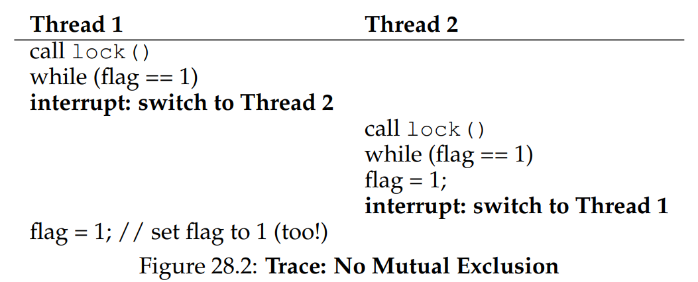

# Ch. 28 - Locks

* As we so in the intro, we want to execute a series of instructions atomically, in order to prevent race conditions
* We will achieve this using **locks**

### 28.1 - Locks: The Basic Idea

* The basic idea is this: Say we have a critical condition like this:
```c
global_var += 1;
```
* This can be made atomic by the following modification:

```c
lock_t mutex;
lock(&mutex);
balance += 1;
unlock(&mutex);
```

* A lock is just a variable, which we call the **lock variable** or just the "lock" for short. It is a binary state, which can either be in a locked state or unlocked state
* Here (and often in other places) it is called `mutex` for "mutual exclusion"
* Only one thread at a time can "hold" the lock (meaning it is the process that locked that lock)
* The basic idea for achieveing this is simple: If a thread calls `lock(&mutex)`, it will lock the `mutex` if it is unlocked, otherwise it will stall returning until the `mutex` is unlocked again
* Once the owner of the lock calls `unlock()` on it, the other thread trying to lock will lock and return

### 28.2 - Pthread Locks

* The above was pseudocode, but real APIs, such as the POSIX library discussed in the last chapter, functions the same for the most part
* We can also have multiple lock variables, in order to lock different parts of the code at the same time

### 28.3 - Building a Lock

* How do we implement these functions on the OS level? What hardware support is needed?
> **The Crux: How to Build a Lock**
> How can we build an efficient lock? Efficient locks provide mutual exclusion at a low cost, and also might attain a few other properties we discuss below. What hardware and OS support is needed?
* Let's see what support we will need

### 28.4 - Evaluating Locks

* What exactly are our goals for a locks library?
  * The lock should provide mutual exclusion, preventing multiple threads from entering a critical section at the same time
  * It should be fair, meaning each thread waiting for a lock to resolve should have a roughly fair chance, and no thread should go starved for a long time waiting on a lock
  * Finally, we want this to be performant and not add too much overhead

### 28.5 - Controlling Interrupts

* One simple approach we can use, which is only valid for single-processor CPUs, to do this is to simply turn off interrupts when a lock is called:
```c
void lock()   { DisableInterrupts(); }
void unlock() { EnableInterrupts(); }
```
* This way, we ensure that the code in between a lock/unlock pair can't be interrupted and is therefore atomic
* This has the advantage of simplicity, but has many disadvantages:
  * First, disabling/enabling interrupts is a kernel-level privilege operation, which user-level programs should not be able to do. At the very least, a user-level programming locking and never un-locking could be disastrous
  * Second, this approach doesn't work on CPUs with multiple cores, since the interrupts will only be disabled on one core and not the others
  * Third, turning off interrupts for a long time will let interrupts expire and fade
* So overall this is not a good solution, and we should look elsewhere. However we can note that this is sometimes still used, but only by the OS, where trust issues aren't relevant

### 28.6 - A Failed Attempt: Just using Loads/Stores

* Let's now try to use a single flag variable to implement the lock
* We can look at an example of this implementation:

```c
typedef struct lock { int flag; } lock_t;

// flag == 0 => unlocked, flag == 1 => locked
void init(lock_t *mutex) {
    mutex->flag = 0;
}

void lock(lock_t *mutex) {
    // Basically waits while the flag is locked
    while (mutex->flag == 1) { ; } 
    mutex->flag = 1;
}

void unlock(lock_t *mutex) { mutex->flag = 0; }
```

* This unfortunately still has two problems. For one, it's non-performant, since the thread that waits for the lock to return is just spinning, called **spin-waiting**. This is wasted time for that thread
* An even more serious issue is that it doesn't work! Considering the following execution order:



* Here, due to the timing of the timer interrupts, the result of both threads calling `lock()` is they both see the flag as set to 1, and they both continue executing! This fails to uphold mutual exclusion

### 28.7 - Building Working Spin Locks with Test-and-Set

* We now introduce some hardware support: the **test-and-set** instruction, or **atomic exchange** instruction
* Let's examine what this instruction does by looking at an equivalent code in C:

```c
int TestAndSet(int *ptr, int new_val) {
    int old_val = *ptr;
    *ptr = new_val;
    return old_val
}
```

* What this instruction does is it updates the value at the given pointer to the new value, and simultaneously returns the old value
* This is enough for us to build a simple **spin lock**, as shown here:

```c
typedef struct lock { int flag; } lock_t;

// flag == 0 => unlocked, flag == 1 => locked
void init(lock_t *mutex) {
    mutex->flag = 0;
}

void lock(lock_t *mutex) {
    // Basically waits while the flag is locked
    while (TestAndSet(&(lock->flag), 1)) { ; }
}

void unlock(lock_t *mutex) { mutex->flag = 0; }
```

* This works because it makes the testing of the lock, and setting it, into a single atomic operation, whereas before it was two atomic instructions
* Now, if a thread is locking a variable for the first time, the `TestAndSet` will set the mutex to 1, and return 0 (since it's the first to lock it), and the lock will not spin
* Whereas if a thread is locking a variable that's already locked, `TestAndSet` will continuously set the mutex to 1 and return 1, spinning until the locking thread unlocks the mutex
* This is one of the simplest functional locks to build. As might be evident, it needs a **preemptive scheduler**, i.e. one that utilizes a timer interrupt, in order to function correctly. Otherwise, on one core, a thread trying to lock an already locked mutex will spin forever

### 28.8 - Evaluating Spin Locks

* Let's revisit our conditions for evaluating the efficacy of our locks:
	* *Correctness:* This system does provide mutual exclusion, by only allowing one thread to enter a critical section at a time
	* *Fairness:* Here we have some bad news, spin locks don't guarantee any kind of fairness, and in fact as we mentioned before, without a scheduler with timer interrupts, a thread may spin forever
	* *Performance:* This evaluates the costs of using the lock system, and will be a bit more complicated to answer
* For a single CPU, the performance for spin locks is quite expensive. Say for example you have 5 threads trying to lock the same variable. For the 4 threads that don't own the lock, they may spin for the entirety of the period between interrupts, wasting a lot of CPU time
* However if we have a number of cores roughly equal to the number of threads, spin locks can be fairly performant

### 28.9 - Compare-and-Swap

* Another hardware primitive that can help is **compare-and-swap** (also called **compare-and-exchange**)
* Let's look at some C pseudocode for this:
```c
int CompareAndSwap(int *ptr, int expected, int new) {
	int original = *ptr;
	if (original == expected) {
		*ptr = new;
	}
	return original;
}
```
* This works similar to the other instruction, but here instead of always swapping out values between old and new, this is only done if the original equals some expected value. The old value is returned either way
* This works similarly for building a spin lock, but can be more powerful in certain systems, as we will see later

### 28.10 - Load-Linked and Store-Conditional

* Some architectures provide two paired instructions: **load-linked** and **store-conditional** instructions. The C pseudocode for these is shown here:
```c
int LoadLinked(int *ptr) {
	return *ptr;
}

int StoreConditional(int *ptr, int value) {
	// cond: true if no update to *ptr since LoadLinked to this address, otherwise false
	if (cond) {
		*ptr = value;
		return 1; // Success!
	} else {
		return 0; // Failed to update
	}
}
```
* 