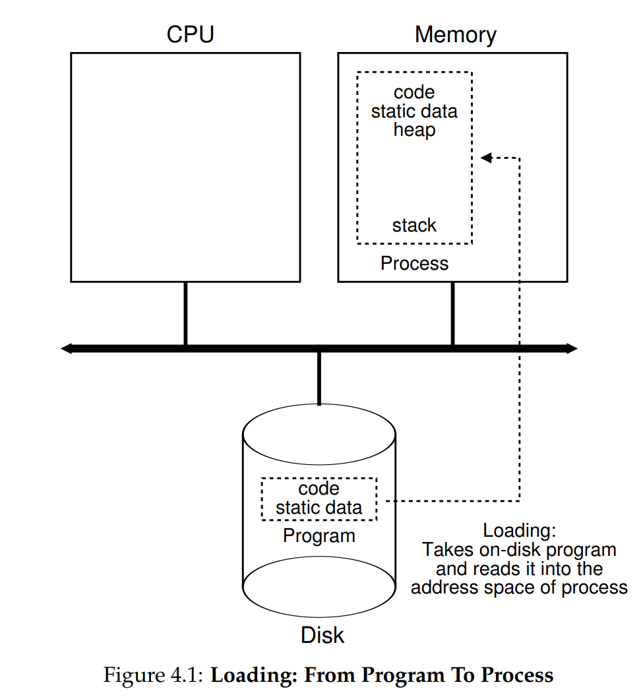
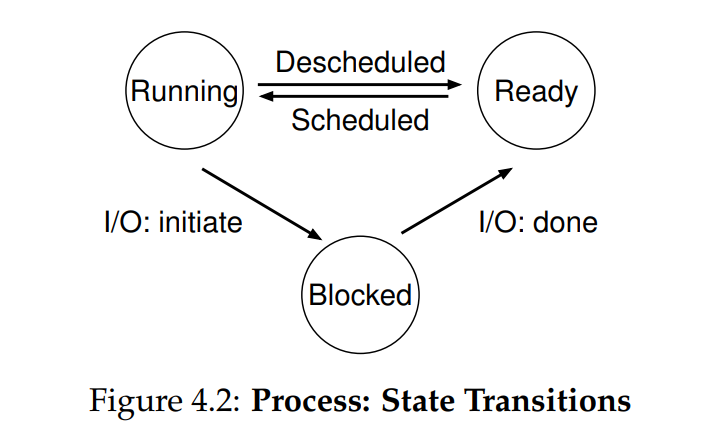
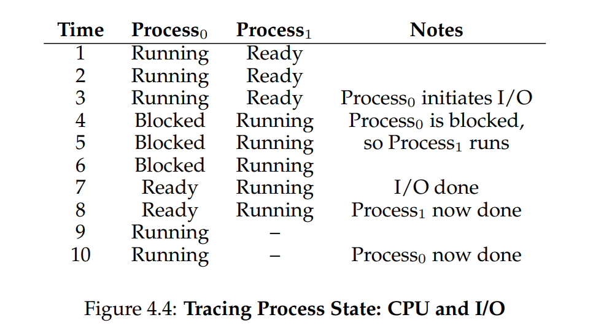

# Ch. 4 - The Abstraction: The Process

- [Ch. 4 - The Abstraction: The Process](#ch-4---the-abstraction-the-process)
    - [4.1 - The Abstraction: A Process](#41---the-abstraction-a-process)
    - [4.2 - Process API](#42---process-api)
    - [4.3 - Process Creation: A little more Detail](#43---process-creation-a-little-more-detail)
    - [4.4 - Process States](#44---process-states)
    - [4.5 - Data Structures](#45---data-structures)
    - [4.6 - Summary](#46---summary)
    - [Homework](#homework)

* One of the most fundamental abstractions that the OS provides is the **process**
* A process is a running program. Programs by themselves are just instructions on disk, the OS is what actually runs them
* But typical systems have hundreds of processes wanting to run at the same time
> **Crux of the Problem:** How to provide illusion of near-endless supply of CPUs?
* OS achieves this by **virtualizing** the CPU, so each process sees its own illusory CPU
* Can do this by **time-sharing**, by stopping one process and running another quickly enough that the user doesn't notice
* To implement virtualization of the CPU, the OS will need both low-level machinery (called **mechanisms**) and high-level intelligence (called **policies**)
* A mechanism is a low-level method that implements a needed piece of functionality (e.g. a **context switch** which lets the OS stop running one program and start running another on the same CPU)
* A policy is an algorithm for making some kind of decision within the OS (e.g. a **scheduling policy** which decides, from a given number of possible programs to run, which one to execute)

### 4.1 - The Abstraction: A Process

* Every process has a **machine state**, which is what the program can read or update when it's running
* The machine state consists of at least the following:
  * The **address space** of the process, which is the memory that process can access
  * The registers that the program can read/write are also included (including the **program counter** (PC), the **stack pointer**, and **frame pointer**)
  * I/O devices the program is accessing, such as the disk, or external devices

### 4.2 - Process API

* We'll discuss this in much more detail later, but here's a preview of what the process APIs look like:
  * **Create**: An OS must include a method for creating new processes
  * **Destroy**: Relatedly, an OS must have an interface to destroy processes forcefully (most processes will run and exit by themselves, but this halts them by force)
  * **Wait**: Will wait for some sort of signal
  * **Miscellaneous Control**: There are sometimes other controls, such as suspending a process and resuming it later 
  * **Status**: There are almost always interfaces to get some status information about a process

### 4.3 - Process Creation: A little more Detail

* How does the OS go from a program (on disk) to a process (in memory)?
* The program is initially on the disk, in an executable format. The OS then:
  * Loads the code and any static data into memory from disk, into the address space of the process
  * Some memory is allocated for the process's **run-time stack**, or just **stack**. This is the same stack that C programs use for local variables, function parameters, etc
  * The OS like initializes this stack, such as with the parameters passed to `main()`
  * The OS also may allocate some memory for the process's **heap**, which is used for dynamically-allocated data. As the heap grows, the OS may come back later and expand this area of memory
  * The OS will also do some other initialization tasks, particularly related to I/O (will learn more about this in the Persistence chapters)
  * Finally, the OS starts process execution wherever the code for `main()` is located
* Here is a visual depiction of this process:



### 4.4 - Process States

* The process can be in a number of different states at any time. In a simplified picture, there are 3 states:
  * **Running**: The process is executing on the processor
  * **Ready**: The process is ready to run, but for some reason the OS is not running it currently
  * **Blocked**: The process would like to perform an operation that makes it not ready to run until another event takes place. This commonly happens whenever a process initiates an I/O request to the disk
* We can draw this in a state diagram like this:



* A process going from Ready to Running means it is **scheduled**, and when it's paused and sent back to Ready means it is **descheduled**
* We can see an example of two processes and how the OS handles them here:



* These decisions are made by the OS scheduler, which we'll learn more about later

### 4.5 - Data Structures

* The OS is a program, and like any other program has some key data structures to keep track of data
* **Process List** is one of these, it keeps track of all processes that are ready and some additional info to track those that are running. The OS must also track in some way blocked processes, so when an I/O event is complete it can get Ready the appropriate process
* A learning-based OS we will often refer to is the **XV6**
* The XV6 process tracker is shown here:

```c
/* Figure 4.5: The xv6 Proc Structure */
// the registers xv6 will save and restore
// to stop and subsequently restart a process
struct context {
    int eip;
    int esp;
    int ebx;
    int ecx;
    int edx;
    int esi;
    int edi;
    int ebp;
};

// the different states a process can be in
enum proc_state { UNUSED, EMBRYO, SLEEPING,
RUNNABLE, RUNNING, ZOMBIE };

// the information xv6 tracks about each process
// including its register context and state
struct proc {
    char* mem; // Start of process memory
    uint sz; // Size of process memory
    char* kstack; // Bottom of kernel stack for this process
    enum proc_state state; // Process state
    int pid; // Process ID
    struct proc* parent; // Parent process
    void* chan; // If !zero, sleeping on chan
    int killed; // If !zero, has been killed
    struct file* ofile[NOFILE]; // Open files
    struct inode* cwd; // Current directory
    struct context context; // Switch here to run process
    struct trapframe* tf; // Trap frame for the current interrupt
};
```

* There are a few important pieces to this structure. One of them is the **Register Context**
* The register context holds, for a stopped process, the contents of the registers it has access to. When the OS runs a **context switch** and restarts the process, it loads the registers with this register context
* We can also see from the `proc_state` enum that there are other states that a process can be in:
  * **EMBRYO**: The process has been created
  * **ZOMBIE**: The process is in a final state where it has exited, but has not yet been cleaned up. This is useful as it allows other processes, usually the parent process, to examine the return code and execution status of the process

### 4.6 - Summary

* We have introduced the most basic abstraction of the OS: The Process!
* The process is quite simply viewed as a running program
* We will now move on to examining the mechanisms and policies that are used to implement and manage processes

### Homework


<!--
```c

```
-->
