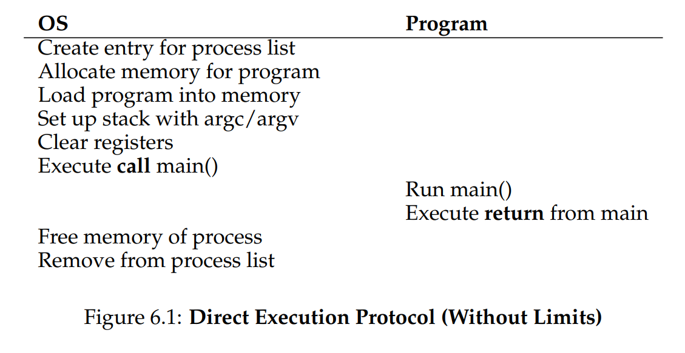
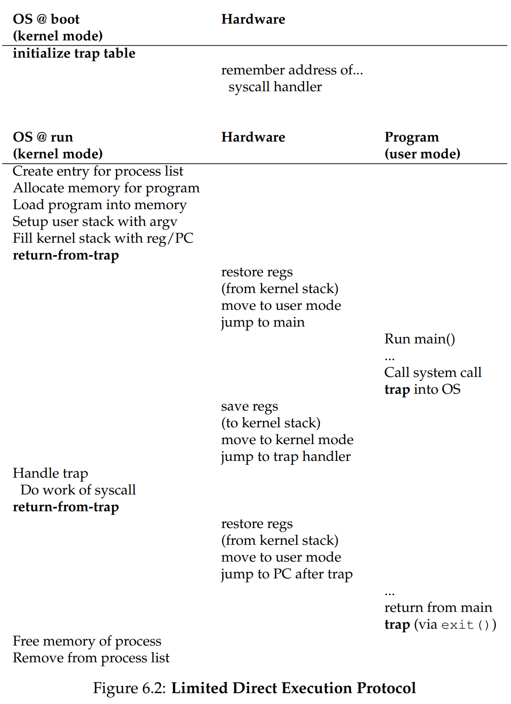
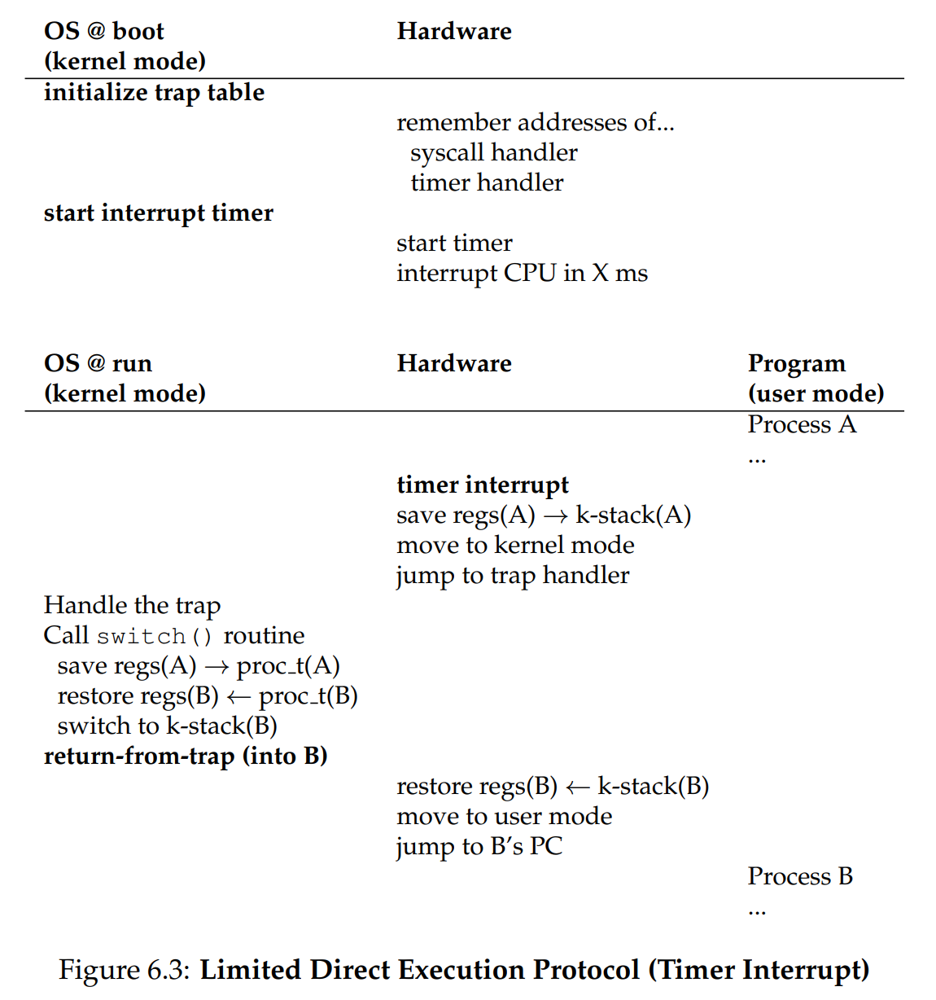

# Ch. 6 - Mechanism: Limited Direct Execution

**Table of Contents**:
- [Ch. 6 - Mechanism: Limited Direct Execution](#ch-6---mechanism-limited-direct-execution)
    - [6.1 - Basic Technique: Limited Direct Execution](#61---basic-technique-limited-direct-execution)
    - [6.2 - Problem #1: Restricted Operations](#62---problem-1-restricted-operations)
    - [6.3 - Problem #2: Switching between Processes](#63---problem-2-switching-between-processes)
    - [6.4 - Worried about Concurrency?](#64---worried-about-concurrency)
    - [6.5 - Summary](#65---summary)

* As we've learned, the OS can virtualize the CPU using time sharing
* However there are some challenges with this:
  * Performance: How can we implement virtualization without adding excessive overhead that slows everything down?
  * How can we run processes efficiently while retaining control over the CPU?

> The Crux: How to efficiently Virtualize the CPU with Control
> The OS must virtualize the CPU in an efficient manner while retaining
control over the system. To do so, both hardware and operating-system
support will be required. The OS will often use a judicious bit of hardware support in order to accomplish its work effectively.

### 6.1 - Basic Technique: Limited Direct Execution

* To solve this, use technique: **limited direct execution** (LDE)
* The **direct execution** part just means the program runs directly on the CPU
* Without limits, it looks like:

* However we still haven't solved the problems mentioned above. Let's see how we'll do that

### 6.2 - Problem #1: Restricted Operations

> The Crux: How to perform Restricted Operations?
> A process must be able to perform I/O and some other restricted operations, but without giving the process complete control over the system. How can the OS and hardware work together to do so?

* We can solve this by introducing a restricted mode for processes called **user mode**. In this mode, the process can't do restricted operations, such as I/O requests
* The way a process can do I/O still is by using **system calls**, using `TRAP` instructions. The `TRAP`, working together with `RTI` instructions, will run an OS instruction while simultaneously raising the privilege level from user to supervisor/kernel mode. The return from trap will then reduce the privilege level again
* This must be done in a way that preserves the calling processes's registers. These are saved onto a **kernel stack**, a unique per-process stack of register values that calling process needs
* The way the `TRAP` instructions execute OS instructions is using a **trap table**, which is set on bootup
* Here is a visualization of the LDE protocol:

* This shows the two phases of the LDE protocol, and privileged operations are shown in bold
* Each system call is usually assigned a **system-call number**. This way the user doesn't have access to the actual address of the OS instruction, but indirectly accesses it using the system-call number

### 6.3 - Problem #2: Switching between Processes

* Here's a big problem with switching processes: remember only one process runs on the CPU at a time. So if that's the case, while a user process is running, the OS isn't. So how can the OS interrupt the user process and regain control?
* One old methodology was a cooperative approach, where the OS trusted the user process to periodically make system calls that would give the OS back control, as well as if the process threw an error. However this has obvious issues if the process is not well written or maliciously written
> The Crux: How to gain Control without Cooperation
> How can the OS gain control of the CPU even if processes are not being cooperative? What can the OS do to ensure a rogue process does not take over the machine?
* The answer is quite simple: a **timer interrupt**. Essentially a timer device can be programmed to raise an interrupt every so many milliseconds. When this happens, the process halts, and an **interrupt handler** in the OS runs
* So during boot, the OS also tells the hardware which code to run when the timer interrupt occurs through an address table, and also starts the timer (which is a privileged operation)
* After the OS regains control, either cooperatively through a system call or through a timer interrupt, the **scheduler** has to decide whether to continue the currently-running process, or switch to a different one
* If the switch is made, the OS runs a low-level piece of code called the **context switch**, where the
> TIP: Reboot is useful
> Reboots are actually a great way to handle a process that is stuck on the CPU and unable to give back control to the OS. This is because reboot moves software back to a known and likely more tested state, they are easy to automate, and they clean up stale/leaked resources such as memory. While this can feel ugly, it's actually quite useful!
* A visualization of this context switch is shown here:

### 6.4 - Worried about Concurrency?

* What if during a system call or an interrupt handle, another interrupt occurs? This is what the subject of **concurrency** is concerned with
* As a taste: One simple thing the OS might do is to disable interrupts during interrupt processing

### 6.5 - Summary

* In essence, we've described some key low-level mechanisms by which the CPU is virtualized, these mechanisms collectively being called **limited direct execution** (LDE)
* This can be described intuitively as "baby-proofing" the CPU
* A major question unanswered: Which process should run at a given time? Next chapter, we dig further into the OS scheduler
