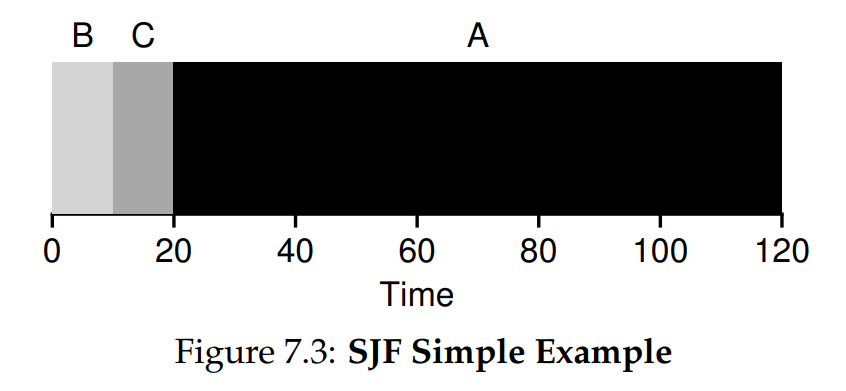

# Ch. 7 - Scheduling: Introduction

* By now the low-level mechanisms of processes (e.g. context switching) should be clear
* Now let's consider the high-level policies that an OS scheduler employs
> The Crux: How to develop Scheduling Policy?
> How should we develop a basic framework for thinking about scheduling policies? What are the key assumptions? What metrics are important? What basic approaches have been used in the earliest of computer systems?

### 7.1 - Workload Assumptions

* The total sum of running processes is called the **workload**
* We are going to adopt a number of simplifying assumptions for now on our workload, that are mostly unrealistic, but we'll fix that by relaxing them as we go:

1. Each job runs for the same amount of time
2. All jobs arrive at the same time
3. Once started, each job runs to completion
4. All jobs only use the CPU (i.e., they perform no I/O)
5. The run-time of each job is known

* After relaxing all assumptions, we'll obtain a **fully-operational scheduling discipline**

### 7.2 - Scheduling Metrics

* In order to compare different scheduling policies, we also need a metric. For us, we'll use the **turnaround time**:
$$T_\text{turnaround} = T_\text{completion} - T_\text{arrival}$$
* Because we assume all jobs arrive at the same time, for now $T_\text{arrival} = 0$
* This is a **performance metric**, meaning it measures the efficacy of performance
* There are also **fairness metric**s, which measures the ability of each program to run

### 7.3 - First In, First Out (FIFO)

* The most basic algorithm is FIFO
* This has the advantage of being simple and easy to implement, and works fairly well under our assumptions
* Imagine the following situation for 3 jobs in the system each with a runtime of 10 seconds:


* Here, the average turnaround time is: $\frac{10 + 20 + 30}{3} = 20$, which isn't too bad
* Now let's relaxe Assumption 1, that "Each job runs for the same amount of time". What would happen if one of our jobs runs for 100 seconds? Then we get:


* Now, the average turnaround time is: $\frac{100 + 110 + 120}{3} = 110$, which is unfortunately high
* This is called the **convoy effect**, where a number of lighter programs are stuck behind a heavyweight program
* What can we do to solve this? An obvious solution might be to run the shortest job first

### 7.4 - Shortest Job First (SJF)

* Let's take a look at this approach:



* Now for the same convoy situation from before, we get an average turnaround time of $50$, which is much better
> **Aside: Preemptive Schedulers**
> In the old days of batch computing, a number of non-preemptive schedulers were developed; such systems would run each job to completion before considering whether to run a new job. Virtually all modern schedulers are preemptive, and quite willing to stop one process from running in order to run another, by utilizing the context switch operations we've seen already
* With our current set of assumptions, SJF is actually the optimal scheduling algorithm. But of course our assumptions are meant to be relaxed, so we're nowhere near done
* Let's relax Assumption 2, that "All jobs arrive at the same time". Now what will happen?
* Well if job A arrives before jobs B and C? Then we get the same convoy effect issue:


### 7.5 - Shortest Time-to-Completion First (STCF)

* Let's solve this by relaxing Assumption 3, that "Once started, each job runs to completion"
* Now we arrive at a preemptive scheduler, which can perform context switches
* With this new scheduler, our convoy situation now looks like:


* Our new average turnaround time is $\frac{(120 - 0) + (20 - 10) + (30 - 10)}{3} = 50$, which is quite good
* As before, with these current assumptions, STCF is the optimal program

### 7.6 - A New Metric: Response Time

* Let's define another performance metric:
$$T_\text{response} = T_\text{first run} - T_\text{arrival}$$
* Now let's take a look at 3 jobs that each take 5 seconds with the SJF policy:


* Here, turnaround time isn't bad, but response time is terrible! Job C in particular has to wait 10 seconds to run. We don't want a situation where the user opens a program, and has to wait 10 seconds for a response

### 7.7 - Round Robin

* To solve this, we will introduce a new scheduling algorithm, clasically called **Round-Robin (RR) Scheduling**
* The basic idea is simple: Instead of running programs to completion, each job runs for a short amount of time (called a **time slice** or **scheduling quantum**), and then switches to the next job in the run queue. It does so repeatedly until all the jobs are complete
* For this reason, RR is sometimes called **time-slicing**
* NOTE: For obvious reasons, the time slice must be a multiple of the timer-interrupt period (e.g. if the timer interrupts every 10 ms, the time-slice could be 10 ms or 30 ms, etc.)
* Now taking our same situation with the 3 jobs above, let's see what RR would do with it:


* Now the average response time is $\frac{0 + 1 + 2}{3} = 1$, which is much better
* Why don't we just make the time-slice the shortest possible to minimize response time? The reason we don't is that context switching itself has a resource cost, from both the OS calls and the saving/flushing of CPU resources
* If you're context switching too much, that will itself drag down performance. So the scheduler has to minimize the cost of switching with the response time
* Also, RR is terrible for turnaround time! This is because RR drags out programs for as long as it can, only executing a little at a time in order to minimize response time
* This is also a consequence of RR being optimal for **fairness**, since each program executes at roughly the same pace and at the same time
* Let's now tackle Assumption 4, that "All jobs only use the CPU (i.e., they perform no I/O)", and Assumption 5, that "The run-time of each job is known"

### 7.8 - Incorporation I/O

* How does the scheduler decide what to do when a process decides to initiate I/O? How does it decide what to do when a process finishes I/O?
* To understand better, let's take 2 jobs A and B, which both need total 50 ms of CPU time. B only uses the CPU without I/O, but A performs I/O that takes 10 seconds after every 10 seconds of CPU usage
* Using the scheduling practices we've seen so far, the two jobs would run one after the other, and we'd get something like:


* This is a poor use of resources, since the CPU is going unused for large portions of time
* Instead, we should implement a scheduler which allows for **overlap** of jobs, as shown here:


* Now the CPU is busy always

### 7.9 - No More Oracle

* Finally, let's relax our last assumption, Assumption 5, that "The run-time of each job is known"
* This is perhaps the most important and least realistic assumption, since the OS almost always knows nothing about the length of a job

### 7.10 - Summary

* We've introduced the basic ideas behind scheduling
* We developed two families of approaches:
  * Minimize Turnaround Time: Run shortest jobs first
  * Minimize Response Time: Run all jobs in short time-slices
* We implemented ways to manage I/O
* We still need to implement a schedluler that doesn't need foreknowledge of the runtime of each process, this will result in the **multi-level feedback queue** scheduler

### Homework (Simulation)

1. *Compute the response time and turnaround time when running three jobs of length 200 with the SJF and FIFO schedulers.*
For FIFO, I ran this command and got this output:
```sh
[ec2-user@ip-172-31-59-75 cpu-sched]$ python scheduler.py -p FIFO -l 200,200
ARG policy FIFO
ARG jlist 200,200

Here is the job list, with the run time of each job:
  Job 0 ( length = 200.0 )
  Job 1 ( length = 200.0 )
```
The turnaround times are:
* Job 0 : $200 - 0 = 200$
* Job 1 : $400 - 0 = 400$
* Average : $\frac{1}{2} (200 + 400) = 300$
The response times are:
* Job 0 : $0 - 0 = 000$
* Job 1 : $200 - 0 = 200$
* Average : $\frac{1}{2} (000 + 200) = 100$

For SJF, since both these jobs have the same length, it will function virtually the same as FIFO, and have the same outputs

2. *Now do the same but with jobs of different lengths: 100, 200, and 300.*
For FIFO, I ran this command and got this output:
```sh
[ec2-user@ip-172-31-59-75 cpu-sched]$ python scheduler.py -p FIFO -l 100,200,300
ARG policy FIFO
ARG jlist 100,200,300

Here is the job list, with the run time of each job:
  Job 0 ( length = 100.0 )
  Job 1 ( length = 200.0 )
  Job 2 ( length = 300.0 )
```
The turnaround times are:
* Job 0 : $100 - 0 = 100$
* Job 1 : $300 - 0 = 300$
* Job 2 : $600 - 0 = 600$
* Average : $\frac{1}{3} (100 + 300 + 600) = 333$
The response times are:
* Job 0 : $0 - 0 = 000$
* Job 1 : $100 - 0 = 100$
* Job 2 : $300 - 0 = 300$
* Average : $\frac{1}{3} (100 + 300) = 133$

For SJF, since both these jobs have the same length, it will function virtually the same as FIFO, and have the same outputs


1. *Now do the same, but also with the RR scheduler and a time-slice of 1.*
For RR, I ran this command and got this output:
```sh
[ec2-user@ip-172-31-59-75 cpu-sched]$ python scheduler.py -p RR -l 100,200,300 -q 1
ARG policy RR
ARG jlist 100,200,300

Here is the job list, with the run time of each job:
  Job 0 ( length = 100.0 )
  Job 1 ( length = 200.0 )
  Job 2 ( length = 300.0 )
```
The turnaround times are:
* Job 0 : $300 - 0 = 300$
* Job 1 : $500 - 0 = 500$
* Job 2 : $600 - 0 = 600$
* Average : $\frac{1}{3} (300 + 500 + 600) = 467$
The response times are:
* Job 0 : $0 - 0 = 0$
* Job 1 : $1 - 0 = 1$
* Job 2 : $2 - 0 = 2$
* Average : $\frac{1}{3} (1 + 2) = 1$

2. *For what types of workloads does SJF deliver the same turnaround times as FIFO?*
3. *For what types of workloads and quantum lengths does SJF deliver the same response times as RR?*
4. *What happens to response time with SJF as job lengths increase? Can you use the simulator to demonstrate the trend?*
5. *What happens to response time with RR as quantum lengths increase? Can you write an equation that gives the worst-case response time, given N jobs?*
