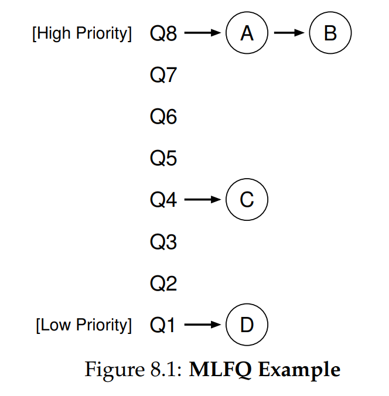
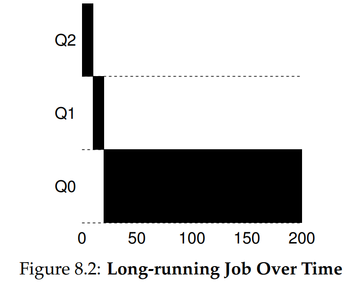
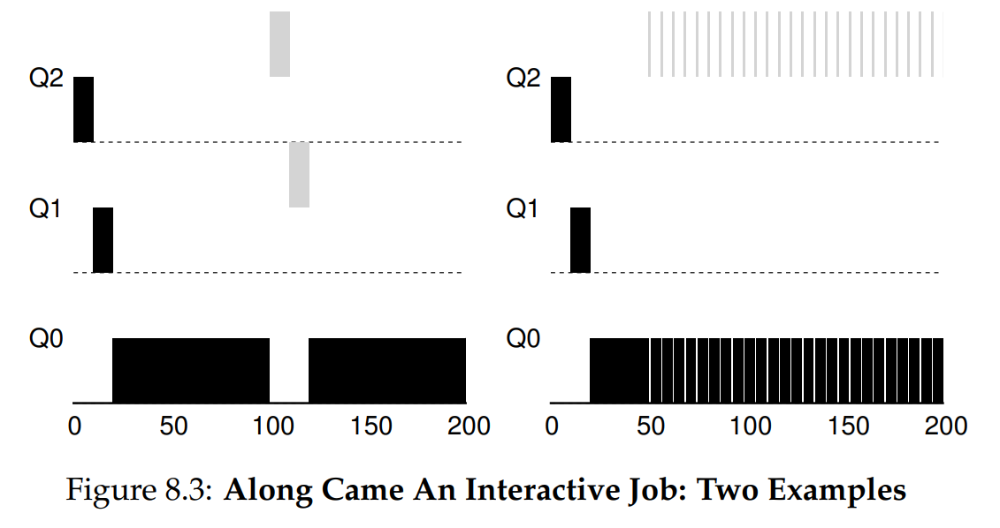
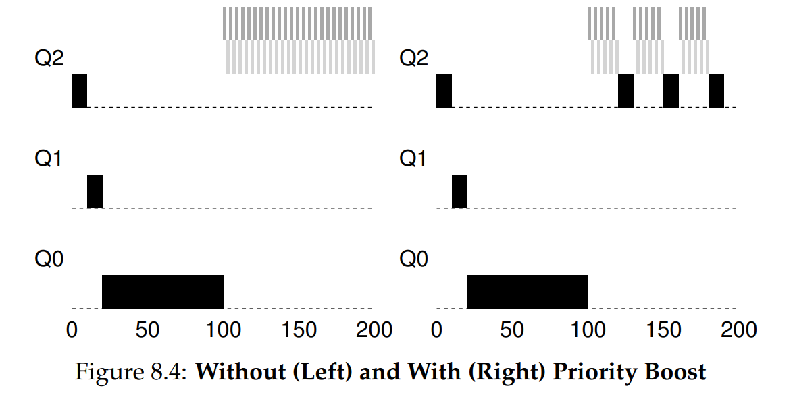
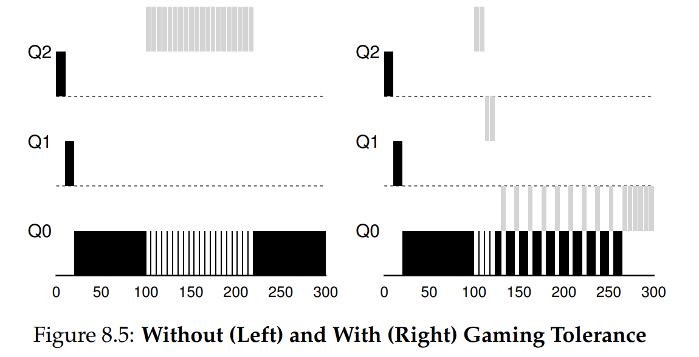

# Ch. 8 - Scheduling: The Multi-Level Feedback Queue

* In this chapter, we’ll tackle the problem of developing one of the most well-known approaches to scheduling, known as the **Multi-level Feedback Queue** (MLFQ)
* The aim of the MLFQ is two-fold: to minimize both turnaround time and response time
> **The Crux: How to schedule without Perfect Knowledge?**
> How can we design a scheduler that both minimizes response time for interactive jobs while also minimizing turnaround time without a priori knowledge of job length?

### 8.1 - MLFQ: Basic Rules

* Although the specifics of many implemented MLFQ's are all different, most approaches are similar to this one
* The MLFQ has a number of distinct queues, each with a different priority level
* At any given time, each process in the ready state is on a single queue
* So the shceduler looks to the highest non-empty priority queue to find which job to run
* For jobs in the same priority queue, which job to run is determined using Round Robin
* So we have the first 2 basic rules for MLFQ:
  * **Rule 1**: If Priority(A) > Priority(B), A runs and B doesn't
  * **Rule 2**: If Priority(A) = Priority(B), RR is used to pick whether A or B runs
* Rather than giving a job a fixed priority, the MLFQ varies the priority of a job based on its observed behavior
* For example, if a process is doing a lot of waiting for keyboard input, the MLFQ will keep its priority high, since it's likely a user-interactive process
* In this way, the MLFQ will try to *learn* about the processes as they run, and use their *history* to predict their *future* behavior
* Here's an example of the MLFQ for 4 processes:

### 8.2 - Attempt #1: How to Change Priority

* Now how exactly does the MLFQ adjust the priority of a job over its lifetime?
* We'll assume two types of jobs in our workload:
  * Short-running interactive jobs that may frequently relinquish the CPU
  * Long-running "CPU-Bound" jobs that need a lot of CPU time, but for whom response time is unimportant
* Let's define **allotment**, which is the amount of time a job can spend at a given priority level before the scheduler reduces its priority. For simplicity, let's assume for now that the allotment is equal to a single time slice
* Here's our first attempt at a priority-adjustment algo:
  * **Rule 3**: When a job enters a system, it's placed at the highest priority
  * **Rule 4a**: If a job uses up its allotment while running, its priority is reduced
  * **Rule 4b**: If a job gives up the CPU before the allotment is up, it stays at the same priority level (i.e. its allotment is reset)
* Simple example program for a time slice of 10 ms:

* Another example: We have 2 jobs, A (long-running CPU-intensive job) and B (short-running interactive job). Assume A has been running for some time, then B arrives. We get:

* On the right, we see why Rule 4b is in place, for interactive programs that do a lot of I/O. Here the interactive process gets input for 1 second, then does I/O, and job A runs in the meantime
* There are three big problems here:
  * If there are too many interactive jobs in the system, they'll consume all the CPU time, and long-running jobs will **starve** for CPU
  * A smart user could write a program specifically to *game the scheduler*, such that their program gets more than its fair share of resources
  * There isn't a way for a long-running CPU process to change its behavior, say for instance to start taking input from the user

### 8.3 - Attempt #2: The Priority Boost

* Let's try to address starvation, by periodically boosting priority of all jobs:
  * **Rule 5**: After some time $S$, move all the jobs to the topmost queue
* Now, processes are guaranteed not to starve, since they'll be in the top priority gueue for at least some time. Also if a CPU-intensive job becomes interactive, the scheduler treats it properly when it gets boosted
* An illustration:

* Here on the left we have our previous ruleset. A CPU-intensive job is running when 2 interactive jobs arrive, and they go back and forth, leaving the first job to hang
* With priority boosting where $S = 100 \text{ ms}$, after 100 ms the CPU-intensive job gets boosted and is able to execute as well
* One problem, that we can't really solve: $S$ is a *magic number*, and has to be set by someone extremely knowledgeable

### 8.4 - Attempt #3: Better Accounting

* How to prevent gaming the scheduler by abusing Rules 4a and 4b?
* An example of how this can be abused is shown here:

* Here a process keeps starting an I/O request just before its allotment finishes, causing it to hog the CPU
* The solution here is better **accounting** of CPU time at each priority level. Instead of resetting allotment at each context switch, instead keep track of the total time has been at a priority level
* So our new Rule is:
  * **Rule 4**: Once a job uses up its time allotment at a given level, regardless of how many times it has given up the CPU, its priority level is reduced
* We can see this happening on the right side of the above figure

### 8.5 - Tuning MLFQ and other Issues

* An immediate problem: There are a lot of parameters here (e.g. how many queues, how big a time slice, how small an allotment) that we need to fine-tune
* Often just need to set these by hand, but there are ways to mitigate this
* One method is to set variable time slices for the different priority queues. For example high priority interactive processes usually only need a short time-slice on the CPU since they're mostly doing I/O
* Other MLFQ implementations calcluate all these using equations, such as FreeBSD

### 8.6 - Summary

* We have described a scheduling approach known as the Multi-Level Feedback Queue (MLFQ), which is so called as it has multiple priority queues, that it switches processes between based on feedback it recieves from them (e.g. how long they're using the CPU, how often they're doing I/O)
* The refined set of MLFQ rules is:
  * **Rule 1**: If Priority(A) > Priority(B), A runs (B doesn’t).
  * **Rule 2**: If Priority(A) = Priority(B), A & B run in round-robin fashion using the time slice (quantum length) of the given queue.
  * **Rule 3**: When a job enters the system, it is placed at the highest priority (the topmost queue).
  * **Rule 4**: Once a job uses up its time allotment at a given level (regardless of how many times it has given up the CPU), its priority is reduced (i.e., it moves down one queue).
  * **Rule 5**: After some time period S, move all the jobs in the system to the topmost queue.
* 

