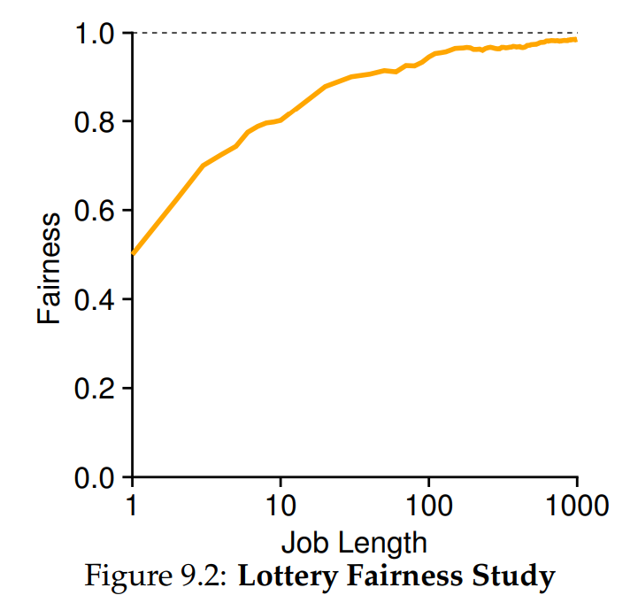
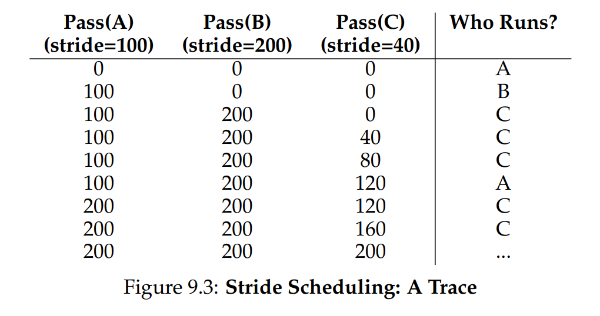

# Ch. 9 - Scheduling: Proportional Share

* Let's examine a type of scheduler called a **propertional-share** or **fair-share** scheduler
* Instead of prioritizing minimizing turnaround and/or response time, this scheduler maximizes fairness
* A standard example of this we'll study now is the **lottery scheduler**
> **Crux: How to share the CPU Proportionally?**
> How can we design a scheduler to share the CPU in a proportional manner? What are the key mechanisms for doing so? How effective are they?

### 9.1 - Basic Concept: Tickets represent your Share

* Lottery scheduling uses **tickets**, which represent the share of a resource that a process should recieve
* Say we have two processes, A with 75 tickets and B with 25 tickets. So, we'd like A to have the CPU 75% of the time and B to have the CPU 25% of the time

> **Tip: Use Randomness**
> When making a decision, using randomness is often a robust and simple way of doing so
>
> Firstly, randomness allows for more flexibility, and often is able to avoid bad edge cases
> Secondly, randomness is often lightweight, requiring only a small state to track alternatives. Deterministic processes require a lot of overhead for tracking purposes
> Finally, random is often fast, often limited by the speed of RNG which is itself almost always very fast

* The way the scheduler chooses which process to run is by drawing a number between 0 and the max number of tickets minus 1. Then the process with that ticket number runs

### 9.2 - Ticket Mechanisms

* Lottery tickets can also be manipulated in useful ways
* For example, say users A and B each get 100 tickets from the system. User A assigns 2 jobs, A1 and A2, 500 tickets each out of a total 1000, and User B assigns 1 job 10 tickets out of a total 10. The OS converts these into the global currency units, so A1, A2, and B get 50, 50, and 100 tickets each
* Processes can also transfer tickets between each other. This is useful in client/server settings, where the client can transfer tickets to the server when it makes a request of the server
* A process can also temporarily raise/lower the number of tickets it owns

### 9.3 - Implementation

* One of the most amazing things about lottery scheduling is its simplicity of implementation
* Say we keep the processes in a linked list
* We can then write a short code to iterate through the linked list and find the process with the correct lottery ticket:

```c
int counter = 0;
int winner = getrandom(0, totaltickets); // returns random int in range [0, totaltickets)
node_t* current = head;

while (current)
{
    counter += current->tickets;
    if (counter > winner) { break; }
    current = current->next;
}
// "current" is the winner, schedule it...
```

### 9.4 - An Example

* Say we have two jobs competing against each other, with the same number of tickets, and both having runtime $R$
* Let's define a fairness metric $F$, which is defined as the ratio of the time the first job completes to the time the second job completes
* We can plot this as a function of $R$:



* As you can see, as the runtime grows, this scheduler becomes more and more fair

### 9.5 - How to assign tickets

* One approach is to assume the user knows best, and let them allocate tickets
* However this obviously assumes too much trust and runs into issues

### 9.6 - Stride Scheduling

* A deterministic fair scheduler that is popular is the **stride scheduler**
* Say we have 3 processses A, B, and C with lottery tickets 100, 50, and 250 respectively
* In this method, there are two values, stride and pass:
  * **Stride**: This is equal to some large value divided by the number of tickets. If we choose this large value to be 10,000, the strides for A, B, and C are 100, 200, and 40 respectively
  * **Pass**: This is equal to 0 at the beginning of the process, and at each step is incremented by the stride
* So we have an example of this illustrated here:



* C runs the most often and B the least, which corresponds to the original ticket amounts
* Why use random lottery schedulers when deterministic ones exist? For the reasons in the aside above. For example, if a new process joins the stride scheduler, should it start at a pass of 0 or not? If it does, it will hog CPU for a long time

### 9.7 - The Linux Completely Fair Scheduler (CFS)

* The CFS is another fair-share scheduler
* Its goal is to spend very little time making decisions
* As each process runs, it accumulates **virtual runtime**, or `vruntime`, which increases at the same rate for all processes and in proportion to clock time
* When a scheduling decision is needed, the CFS will pick the process with the **lowest** `vruntime` to run next
* The CFS manages when to interrupt a running program through various control parameters
* `sched_latency`: This value determines how long one process should run before considering a switch (effectively a dynamic version of the time slice). CFS will divide this by the number of processes for the time slice for each process
* `min_granularity`: The minimum size of the time slice for each process, helps prevent too small a time slice if there are lots of processes
* CFS also has priority levels, through what it calls **niceness**, which is an integer that can go from -20 (highest priority) to +19 (lowest priority)
* Each niceness corresponds to some weight value, that controls the fraction of the `sched_latency` that is given to the process through the formula: $\text{time-slice}_k = \frac{\text{weight}_k}{\text{total-weight}} \times \text{sched-latency}$
* The `vruntime` incrementing is also adjusting to account for the different "niceness" weights
* To maximize speed and minimize scheduling overhead, the CFS doesn't use lists but instead a **red-black tree**, which is a balanced tree. Only running processes are kept here, blocked processes are kept track elsewhere

### 9.8 - Summary

* We have introduced the concept of proportional-share scheduling and discussed three approaches to this:
  * Lottery scheduling
  * Stride scheduling
  * Linux CFS
* Cons of fair-shedulers:
  * CPU-intensive processes may not get their fair-share of the CPU
  * Needs a lot of fine-tuning (e.g. how many tickets to assign)
* In systems where these above concerns aren't an issue, such as with data centers or cloud servers, this kind of scheduler can be very useful
